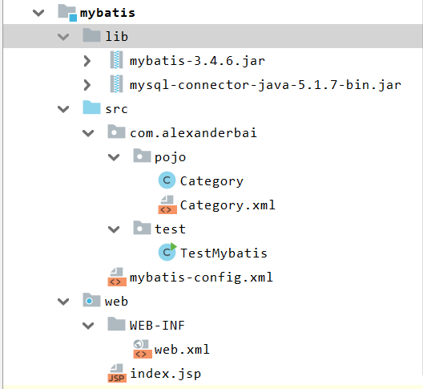
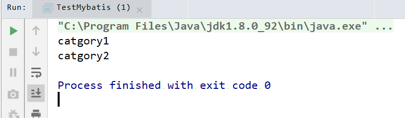
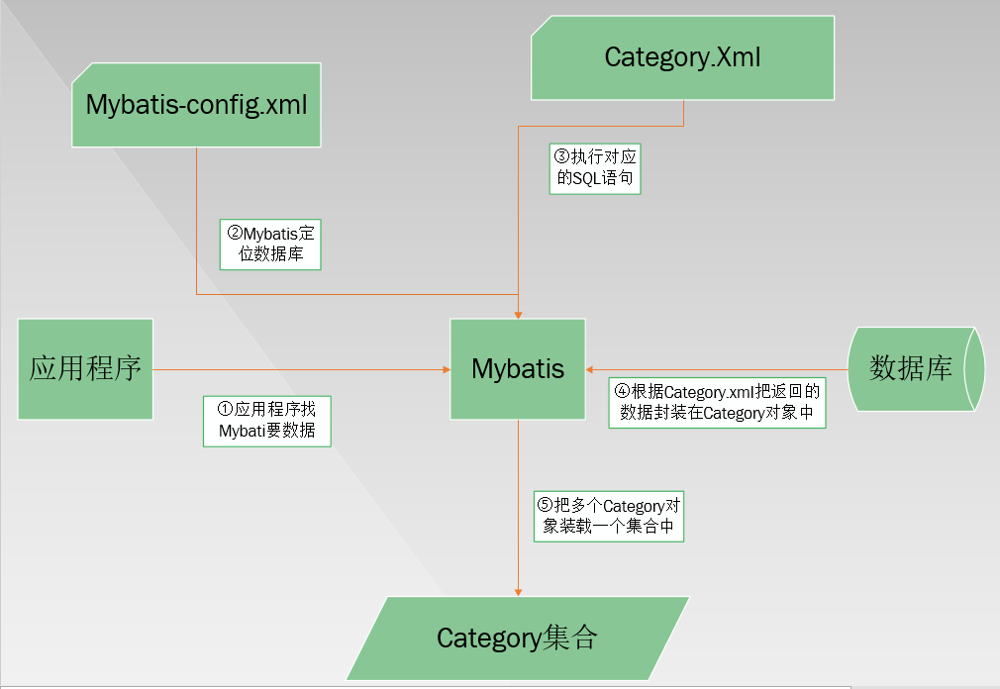
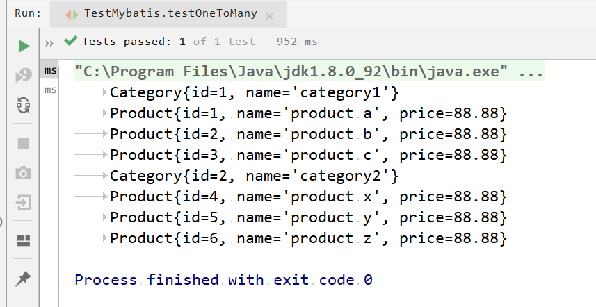
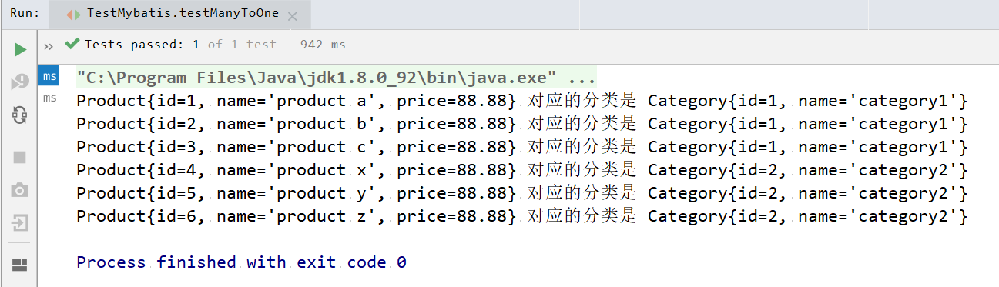
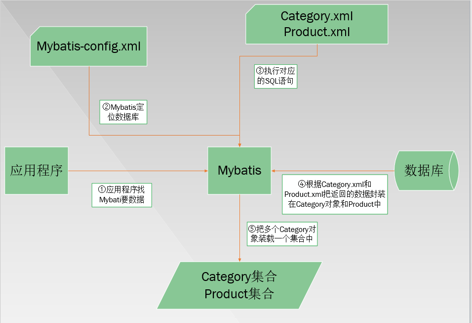
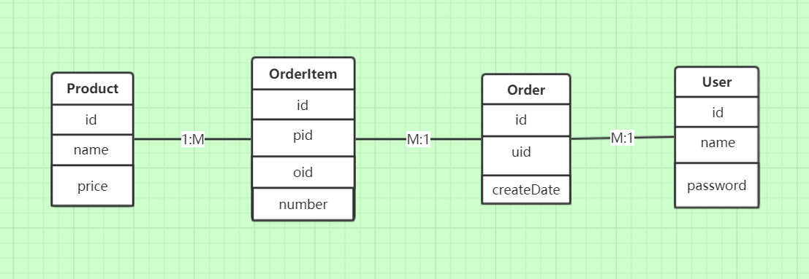
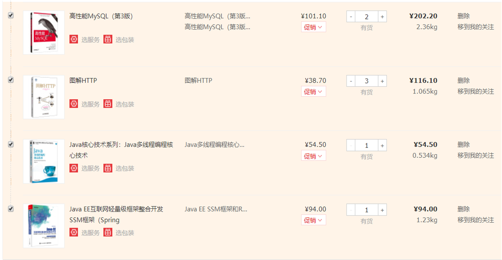

### 一、Mybatis基础入门

- 之前没有引入框架之前，持久层开发使用的是原生的JDBC代码，有复杂的参数需要手工设置，以及结果集的搜索
- `Mybatis`是一个支持**普通SQL查询**、**存储过程**和**高级映射**的一个<font color=red>持久层框架</font>，几乎消除了JDBC代码和参数的手工设置以及结果集的查询。
- Mybatis可以使用简单的<font color=red>XML或注解</font>用于配置和原始映射，将**接口**和**Java中的POJO（普通Java类）**映射成数据库中的记录

#### 1、Mybatis入门

**使用Mybatis开发一个小demo，用于查询数据库中的记录**

- 创建数据库、数据表、记录

  - 建库

  ```
  create database test;
  ```

  - 建表

    ```sql
    USE test;
     
    CREATE TABLE category_ (
      id int(11) NOT NULL AUTO_INCREMENT,
      name varchar(32) DEFAULT NULL,
      PRIMARY KEY (id)
    ) ENGINE=MyISAM AUTO_INCREMENT=1 DEFAULT CHARSET=utf8;
    ```

    - 创建成功

    ```sql
    mysql> desc category_;
    +-------+-------------+------+-----+---------+----------------+
    | Field | Type        | Null | Key | Default | Extra          |
    +-------+-------------+------+-----+---------+----------------+
    | id    | int(11)     | NO   | PRI | NULL    | auto_increment |
    | name  | varchar(32) | YES  |     | NULL    |                |
    +-------+-------------+------+-----+---------+----------------+
    2 rows in set (0.06 sec)
    ```

  - 创建记录（导入数据）

    ```sql
    INSERT INTO category_ VALUES (null,'category1');
    INSERT INTO category_ VALUES (null,'category2');
    ```

    - 新建记录成功

      ```sql
      mysql> select * from category_;
      +----+----------+
      | id | name     |
      +----+----------+
      |  1 | catgory1 |
      |  2 | catgory2 |
      +----+----------+
      2 rows in set (0.00 sec)
      ```

- 创建项目并导入相关包

  项目目录结构，其中web目录在项目中不做任何配置或修改



- 实体类-用于映射数据库表

```java
package com.alexanderbai.pojo;

/**
 * @Description 实体类，用于映射数据库中的记录
 * @Author AlexanderBai
 * @Data 2019/4/11 21:25
 * @Vision 1.0.0
 **/
public class Category {
    private int id;
    private String name;

    public int getId() {
        return id;
    }

    public void setId(int id) {
        this.id = id;
    }

    public String getName() {
        return name;
    }

    public void setName(String name) {
        this.name = name;
    }
}
```

- 配置相关文件

  - 配置**mybatis-config.xml**文件

    ```xml
    <!--DTD约束-->
    <!DOCTYPE configuration 		
            PUBLIC "-//mybatis.org//DTD Config 3.0//EN"
            "http://mybatis.org/dtd/mybatis-3-config.dtd">
    
    <configuration>
    
        <!--
            类型别名，自动扫描com.alexanderbai.pojo下的类型，
    		使得后续配置文件Category.xml中使用resultType的时候，可以直接使用Category
        -->
        <typeAliases>
            <package name="com.alexanderbai.pojo"/>
        </typeAliases>
    
        <!--配置数据库环境变量，可以同时配置多个，default指定具体的数据库环境的id即可-->
        <environments default="development">
            <environment id="development">
            <!--事务管理-->
            <transactionManager type="JDBC"></transactionManager>
            <!--数据源-->
            <dataSource type="POOLED">
                    <!--连接数据库需要的属性-->
                    <property name="driver" value="com.mysql.jdbc.Driver"/>
                    <property name="url" value="jdbc:mysql://localhost:3306/test?
                    useUnicode=true&amp;characterEncoding=utf-8"/>
                    <property name="username" value="root"/>
                    <property name="password" value="ROOT"/>
            </dataSource>
            </environment>
        </environments>
    
        <!--映射Category.xml-->
        <mappers>
            <mapper resource="com/alexanderbai/pojo/Category.xml"/>
        </mappers>
    
    </configuration>
    ```

  - 配置Category.xml文件

  ```xml
  <?xml version="1.0" encoding="UTF-8" standalone="no"?>
  <!DOCTYPE mapper
          PUBLIC "-//mybatis.org//DTD Mapper 3.0//EN"
          "http://mybatis.org/dtd/mybatis-3-mapper.dtd">
  
  <!--命名空间，后续调用SQL语句的时候要用到它-->
  <mapper namespace="com.alexanderbai.pojo">
      <select id="listCategory" resultType="Category">
          select * from category_    /*SQL语句*/
      </select>
  </mapper>
  ```

- 测试

  ```java
  package com.alexanderbai.test;
  
  import com.alexanderbai.pojo.Category;
  import org.apache.ibatis.io.Resources;
  import org.apache.ibatis.session.SqlSession;
  import org.apache.ibatis.session.SqlSessionFactory;
  import org.apache.ibatis.session.SqlSessionFactoryBuilder;
  
  import java.io.IOException;
  import java.io.InputStream;
  import java.util.List;
  
  /**
   * @Description 测试类
   * @Author AlexanderBai
   * @Data 2019/4/11 23:26
   * @Vision 1.0.0
   **/
  public class TestMybatis {
      public static void main(String[] args) {
          String resource = "mybatis-config.xml";
          InputStream inputStream = null;
          try {
              //加载配置文件
              inputStream = Resources.getResourceAsStream(resource);
          } catch (IOException e) {
              e.printStackTrace();
          }
          //构件SqlSession的工厂
          SqlSessionFactory sqlSessionFactory=new SqlSessionFactoryBuilder().build(inputStream);
          //创建能映射配置文件中SQL的SqlSession
          SqlSession sqlSession=sqlSessionFactory.openSession();
          List<Category> list=sqlSession.selectList("listCategory");//映射配置文件中的SQL字符串
          for (Category category :
                  list) {
              System.out.println(category.getName());
          }
      }
  }
  ```

- 运行效果

  

- 原理图

  

####2、Mybatis CRUD

- 在1的基础上修改Category.xml文件

```xml
<?xml version="1.0" encoding="UTF-8" standalone="no"?>
<!DOCTYPE mapper
        PUBLIC "-//mybatis.org//DTD Mapper 3.0//EN"
        "http://mybatis.org/dtd/mybatis-3-mapper.dtd">

<!--命名空间，后续调用SQL语句的时候要用到它-->
<mapper namespace="com.alexanderbai.pojo">
    <insert id="addCategory" parameterType="Category">
        insert into category_ (name) values (#{name})
    </insert>

    <delete id="deleteCategory" parameterType="Category">
        delete from category_ where id=#{id}
    </delete>

    <select id="getCategory" parameterType="_int" resultType="Category">
        select * from category_ where id=#{id}
    </select>

    <update id="updateCategory" parameterType="Category">
        update category_ set name=#{name} where id=#{id}
    </update>

    <select id="listCategory" resultType="Category">
        select * from category_
    </select>
</mapper>
```

- 测试

  ```java
  package com.alexanderbai.test;
  
  import com.alexanderbai.pojo.Category;
  import org.apache.ibatis.io.Resources;
  import org.apache.ibatis.session.SqlSession;
  import org.apache.ibatis.session.SqlSessionFactory;
  import org.apache.ibatis.session.SqlSessionFactoryBuilder;
  import org.junit.Test;
  
  import java.io.IOException;
  import java.io.InputStream;
  import java.util.List;
  
  /**
   * @Description 测试类
   * @Author AlexanderBai
   * @Data 2019/4/11 23:26
   * @Vision 1.0.0
   **/
  public class TestMybatis {
  
      Category category = new Category();
      String resource = "mybatis-config.xml";
      InputStream inputStream = null;
  
      /**
       * 创建SqlSession
       * @return SqlSession
       */
      private static SqlSession getSqlSession() {
          String resource = "mybatis-config.xml";
          InputStream inputStream = null;
          try {
              inputStream = Resources.getResourceAsStream(resource);
          } catch (IOException e) {
              e.printStackTrace();
          }
          SqlSessionFactory sqlSessionFactory=new SqlSessionFactoryBuilder().build(inputStream);
          SqlSession sqlSession=sqlSessionFactory.openSession();
          return sqlSession;
      }
  
      /**
       * 关闭SqlSession
       * @param sqlSession
       */
      private static void closeSqlSession(SqlSession sqlSession) {
          sqlSession.commit();
          sqlSession.close();
      }
  
      /**
       * 查询所有记录
       * @param sqlSession
       */
  
      public  static void listAll(SqlSession sqlSession) {
          sqlSession = TestMybatis.getSqlSession();
          List<Category> list=sqlSession.selectList("listCategory");
          for (Category category :
                  list) {
              System.out.println(category.getName());
          }
      }
  
      /**
       * 获取所有记录，这里对listALL()方法进一步封装只是为了使用单元测试
       */
      @Test
      public void getAll() {
          SqlSession sqlSession=TestMybatis.getSqlSession();
          TestMybatis.listAll(sqlSession);
      }
  
  
      /**
       * 增加记录
       */
      @Test
      public void testAdd() {
          SqlSession sqlSession = TestMybatis.getSqlSession();
          category.setName("新增加的Category");
          sqlSession.insert("addCategory", category);
          TestMybatis.listAll(sqlSession);
          TestMybatis.closeSqlSession(sqlSession);
      }
  
      /**
       * 根据id获取记录
       */
      @Test
      public void testGet() {
          SqlSession sqlSession=TestMybatis.getSqlSession();
          Category category1=sqlSession.selectOne("getCategory", 2);
          System.out.println(category1.getName());
          TestMybatis.closeSqlSession(sqlSession);
      }
  
      /**
       * 修改记录
       */
      @Test
      public void testUpdate() {
          SqlSession sqlSession=TestMybatis.getSqlSession();
          Category category1 = sqlSession.selectOne("getCategory", 2);
          category1.setName("修改了的Category名爵");
          sqlSession.update("updateCategory",category1);
          TestMybatis.listAll(sqlSession);
          TestMybatis.closeSqlSession(sqlSession);
      }
  
      /**
       * 删除记录
       */
      @Test
      public void testDelete() {
          category.setId(2);
          SqlSession sqlSession=TestMybatis.getSqlSession();
          sqlSession.delete("deleteCategory", category);
          TestMybatis.listAll(sqlSession);
          TestMybatis.closeSqlSession(sqlSession);
      }
  }
  ```

#### 3、Mybatis更多查询

新增

- 模糊查询

- 多条件查询

  -  修改Category.xml

  ```xml
  <?xml version="1.0" encoding="UTF-8" standalone="no"?>
  <!DOCTYPE mapper
          PUBLIC "-//mybatis.org//DTD Mapper 3.0//EN"
          "http://mybatis.org/dtd/mybatis-3-mapper.dtd">
  
  <!--命名空间，后续调用SQL语句的时候要用到它-->
  <mapper namespace="com.alexanderbai.pojo">
      <insert id="addCategory" parameterType="Category">
          insert into category_ (name) values (#{name})
      </insert>
  
      <delete id="deleteCategory" parameterType="Category">
          delete from category_ where id=#{id}
      </delete>
  
      <select id="getCategory" parameterType="_int" resultType="Category">
          select * from category_ where id=#{id}
      </select>
  
      <update id="updateCategory" parameterType="Category">
          update category_ set name=#{name} where id=#{id}
      </update>
  
      <select id="listCategory" resultType="Category">
          select * from category_
      </select>
  
      <!--模糊查询-->
      <select id="listCategoryByName" parameterType="String" resultType="Category">
          select * from category_ where name like concat('%',#{name},'%');
      </select>
  
      <!--多条件查询-->
      <select id="listCategoryByNameAndId" parameterType="map" resultType="Category">
          select * from category_ where id > #{id} and name like concat('%',#{name},'%');
      /*
          上述SQL被Mybatis翻译为PreparedStatement的SQL: select * from 
          category_ where id > ? and name like concat('%',?,'%');
        */
      </select>
  </mapper>
  ```

  - 测试

  ```java
  package com.alexanderbai.test;
  
  import com.alexanderbai.pojo.Category;
  import org.apache.ibatis.io.Resources;
  import org.apache.ibatis.session.SqlSession;
  import org.apache.ibatis.session.SqlSessionFactory;
  import org.apache.ibatis.session.SqlSessionFactoryBuilder;
  import org.junit.Test;
  
  import java.io.IOException;
  import java.io.InputStream;
  import java.util.*;
  
  /**
   * @Description 测试类
   * @Author AlexanderBai
   * @Data 2019/4/11 23:26
   * @Vision 1.0.0
   **/
  public class TestMybatis {
  
      static Category category = new Category();
      static SqlSession sqlSession = null;
  
      /**
       * 创建SqlSession
       * @return SqlSession
       */
      private static SqlSession getSqlSession() {
          String resource = "mybatis-config.xml";
          InputStream inputStream = null;
          try {
              inputStream = Resources.getResourceAsStream(resource);
          } catch (IOException e) {
              e.printStackTrace();
          }
          SqlSessionFactory sqlSessionFactory=new SqlSessionFactoryBuilder().build(inputStream);
          SqlSession sqlSession=sqlSessionFactory.openSession();
          return sqlSession;
      }
  
      /**
       * 关闭SqlSession
       * @param sqlSession
       */
      private static void closeSqlSession(SqlSession sqlSession) {
          sqlSession.commit();
          sqlSession.close();
      }
  
      /**
       * 查询所有记录
       * @param list
       */
  
      public  static void listAll(List<Category> list) {
          sqlSession = TestMybatis.getSqlSession();
          list=sqlSession.selectList("listCategory");
          for (Category category :
                  list) {
              System.out.println(category.getName());
          }
      }
  
      /**
       * 获取所有记录，这里对listALL()方法进一步封装只是为了使用单元测试
       */
      @Test
      public void getAll() {
          sqlSession=TestMybatis.getSqlSession();
          TestMybatis.listAll(new ArrayList<>());
      }
  
  
      /**
       * 增加记录
       */
      @Test
      public void testAdd() {
          sqlSession = TestMybatis.getSqlSession();
          category.setName("新增加的Category");
          sqlSession.insert("addCategory", category);
          TestMybatis.listAll(new ArrayList<>());
          TestMybatis.closeSqlSession(sqlSession);
      }
  
      /**
       * 根据id获取记录
       */
      @Test
      public void testGet() {
          sqlSession=TestMybatis.getSqlSession();
          category=sqlSession.selectOne("getCategory", 16);
          System.out.println(category.getName());
          TestMybatis.closeSqlSession(sqlSession);
      }
  
      /**
       * 修改记录
       */
      @Test
      public void testUpdate() {
          sqlSession=TestMybatis.getSqlSession();
          category = sqlSession.selectOne("getCategory", 17);
          category.setName("修改了的Category名爵");
          sqlSession.update("updateCategory",category);
          TestMybatis.listAll(new ArrayList<>());
          TestMybatis.closeSqlSession(sqlSession);
      }
  
      /**
       * 删除记录
       */
      @Test
      public void testDelete() {
          category.setId(16);
          sqlSession=TestMybatis.getSqlSession();
          sqlSession.delete("deleteCategory", category);
          TestMybatis.listAll(new ArrayList<>());
          TestMybatis.closeSqlSession(sqlSession);
      }
  
      /**
       * 模糊查询
       */
      @Test
      public void getByName() {
          sqlSession=TestMybatis.getSqlSession();
          List<Category> listCategoryByName=sqlSession.selectList("listCategoryByName", "cat");
          TestMybatis.listAll(listCategoryByName);
          TestMybatis.closeSqlSession(sqlSession);
      }
  
      /**
       * 多条件查询
       */
      @Test
      public void getByNameAndId() {
          sqlSession=TestMybatis.getSqlSession();
          Map<String, Object> params = new HashMap<>();
          params.put("id", 3);
          params.put("name", "cat");
          List<Category> list=sqlSession.selectList("listCategoryByNameAndId", params);
          TestMybatis.listAll(list);
          TestMybatis.closeSqlSession(sqlSession);
      }
  }
  ```

####4、Mybatis关系

##### （1）、一对多

一种分类对应多种产品

- 新建Product（产品）和Category（分类）表

  ```sql
  mysql> create table product(
      -> id int NOT NULL AUTO_INCREMENT,
      -> name varchar(30)  DEFAULT NULL,
      -> price float  DEFAULT 0,
      -> cid int ,
      -> PRIMARY KEY (id)
      -> )AUTO_INCREMENT=1 DEFAULT CHARSET=utf8;
  Query OK, 0 rows affected (0.09 sec)
  ```

  ```sql
  mysql> desc product;
  +-------+-------------+------+-----+---------+----------------+
  | Field | Type        | Null | Key | Default | Extra          |
  +-------+-------------+------+-----+---------+----------------+
  | id    | int(11)     | NO   | PRI | NULL    | auto_increment |
  | name  | varchar(30) | YES  |     | NULL    |                |
  | price | float       | YES  |     | 0       |                |
  | cid   | int(11)     | YES  |     | NULL    |                |
  +-------+-------------+------+-----+---------+----------------+
  4 rows in set (0.02 sec)
  ```

  

  ```sql
  mysql> create table category(
      ->  id int(11) NOT NULL AUTO_INCREMENT,
      ->   name varchar(32) DEFAULT NULL,
      ->   PRIMARY KEY (id)
      -> ) ENGINE=MyISAM AUTO_INCREMENT=1 DEFAULT CHARSET=utf8;
  Query OK, 0 rows affected (0.09 sec)
  ```

  ```
  mysql> desc category;
  +-------+-------------+------+-----+---------+----------------+
  | Field | Type        | Null | Key | Default | Extra          |
  +-------+-------------+------+-----+---------+----------------+
  | id    | int(11)     | NO   | PRI | NULL    | auto_increment |
  | name  | varchar(32) | YES  |     | NULL    |                |
  +-------+-------------+------+-----+---------+----------------+
  2 rows in set (0.02 sec)
  ```

  

- 导入数据

  - 表category

  ```sql
  mysql> insert into category values(1,'category1'),(2,'category2');
  Query OK, 2 rows affected (0.00 sec)
  Records: 2  Duplicates: 0  Warnings: 0
  ```

  ```sql
  mysql> select * from category;
  +----+-----------+
  | id | name      |
  +----+-----------+
  |  1 | category1 |
  |  2 | category2  |
  +----+-----------+
  2 rows in set (0.00 sec)
  ```

  - 表product

  ```sql
  mysql> insert into product values(1,'product a',88.88,1),(2,'product b',88.88,1),(3,'product c',88.88,1),(4,'product x',88.88,2),(5,'product y',88.88,2),(6,'product z',88.88,2);
  Query OK, 6 rows affected (0.06 sec)
  Records: 6  Duplicates: 0  Warnings: 0
  ```

  ```sql
  mysql> select * from product;
  +----+-----------+-------+------+
  | id | name      | price | cid  |
  +----+-----------+-------+------+
  |  1 | product a | 88.88 |    1 |
  |  2 | product b | 88.88 |    1 |
  |  3 | product c | 88.88 |    1 |
  |  4 | product x | 88.88 |    2 |
  |  5 | product y | 88.88 |    2 |
  |  6 | product z | 88.88 |    2 |
  +----+-----------+-------+------+
  6 rows in set (0.00 sec)
  ```

- Category和Product实体类

  ```java
  package com.alexanderbai.pojo;
  
  /**
   * @Description TODO
   * @Author AlexanderBai
   * @Data 2019/4/13 11:13
   * @Vision 1.0.0
   **/
  public class Product {
      private Integer id;
      private String name;
      private Float price;
  
      public Integer getId() {
          return id;
      }
  
      public void setId(Integer id) {
          this.id = id;
      }
  
      public String getName() {
          return name;
      }
  
      public void setName(String name) {
          this.name = name;
      }
  
      public Float getPrice() {
          return price;
      }
  
      public void setPrice(Float price) {
          this.price = price;
      }
  
      @Override
      public String toString() {
          return "Product{" +
                  "id=" + id +
                  ", name='" + name + '\'' +
                  ", price=" + price +
                  '}';
      }
  }
  ```

  ```java
  package com.alexanderbai.pojo;
  
  import java.util.List;
  
  /**
   * @Description 实体类，用于映射数据库中的记录
   * @Author AlexanderBai
   * @Data 2019/4/11 21:25
   * @Vision 1.0.0
   **/
  public class Category {
      private int id;
      private String name;
      private List<Product> productList;
  
      public int getId() {
          return id;
      }
  
      public void setId(int id) {
          this.id = id;
      }
  
      public String getName() {
          return name;
      }
  
      public void setName(String name) {
          this.name = name;
      }
  
      public List<Product> getProductList() {
          return productList;
      }
  
      public void setProductList(List<Product> productList) {
          this.productList = productList;
      }
  
      @Override
      public String toString() {
          return "Category{" +
                  "id=" + id +
                  ", name='" + name + '\'' +
                  '}';
      }
  }
  ```

  

- Category.xml配置文件

  ```xml
  <?xml version="1.0" encoding="UTF-8" standalone="no"?>
  <!DOCTYPE mapper
          PUBLIC "-//mybatis.org//DTD Mapper 3.0//EN"
          "http://mybatis.org/dtd/mybatis-3-mapper.dtd">
  
  <!--命名空间，后续调用SQL语句的时候要用到它-->
  <mapper namespace="com.alexanderbai.pojo">
      <resultMap id="categoryBean" type="Category">
          <id column="cid" property="id"/>
          <result column="cname" property="name"/>
  
          <!--一对多关系-->
          <!--property:指集合属性的值，ofType：指集合中元素的类型-->
          <collection property="productList" ofType="Product">
              <id column="pid" property="id"/>
              <result column="pname" property="name"/>
              <result column="price" property="price"/>
          </collection>
      </resultMap>
  
     <!--关联查询分类和产品表，通过resultMap实现字段和属性的对应-->
      <select id="listCategoryOneToMany" resultMap="categoryBean">
          /*左连接*/
          /*select c.*,p.*,c.id 'c.id',p.id 'p.id',c.name 'c.name',p.name 'p.name'
          from category c left join product p  on c.id=p.cid*/
  
          /*等值连接*/
          select c.*, p.*, c.id 'cid', p.id 'pid', c.name 'cname', p.name 'pname'
          from category c inner join product  p on c.id = p.cid
  
           /*右连接*/
          /*select c.*, p.*, c.id 'cid', p.id 'pid', c.name 'cname', p.name 'pname'
          from category c right join product  p on c.id = p.cid*/
      </select>
  </mapper>
  ```

- 测试

```java
package com.alexanderbai.test;

import com.alexanderbai.pojo.Category;
import com.alexanderbai.pojo.Product;
import org.apache.ibatis.io.Resources;
import org.apache.ibatis.session.SqlSession;
import org.apache.ibatis.session.SqlSessionFactory;
import org.apache.ibatis.session.SqlSessionFactoryBuilder;
import org.junit.Test;

import java.io.IOException;
import java.io.InputStream;
import java.util.*;

/**
 * @Description 测试类
 * @Author AlexanderBai
 * @Data 2019/4/11 23:26
 * @Vision 1.0.0
 **/
public class TestMybatis {

    static Category category = new Category();
    static SqlSession sqlSession = null;

    /**
     * 创建SqlSession
     * @return SqlSession
     */
    private static SqlSession getSqlSession() {
        String resource = "mybatis-config.xml";
        InputStream inputStream = null;
        try {
            inputStream = Resources.getResourceAsStream(resource);
        } catch (IOException e) {
            e.printStackTrace();
        }
        SqlSessionFactory sqlSessionFactory=new SqlSessionFactoryBuilder().build(inputStream);
        SqlSession sqlSession=sqlSessionFactory.openSession();
        return sqlSession;
    }

    /**
     * 关闭SqlSession
     * @param sqlSession
     */
    private static void closeSqlSession(SqlSession sqlSession) {
        sqlSession.commit();
        sqlSession.close();
    }
    
    @Test
    public void testOneToMany() {
        sqlSession=TestMybatis.getSqlSession();
        List<Category> list=sqlSession.selectList("listCategoryOneToMany");
        for (Category category: list) {
            System.out.println("\t"+category);
            for (Product product : category.getProductList()) {
                System.out.println("\t"+product);
            }
        }
        TestMybatis.closeSqlSession(sqlSession);
    }
}
```

- 运行效果

  


##### （2）、多对一

- 修改实体类Product

  ``` java
  private Category category;/增加category属性
  ```

  ```java
  package com.alexanderbai.pojo;
  
  /**
   * @Description TODO
   * @Author AlexanderBai
   * @Data 2019/4/13 11:13
   * @Vision 1.0.0
   **/
  public class Product {
      private Integer id;
      private String name;
      private Float price;
      private Category category;
  
      public Category getCategory() {
          return category;
      }
  
      public void setCategory(Category category) {
          this.category = category;
      }
  
      public Integer getId() {
          return id;
      }
  
      public void setId(Integer id) {
          this.id = id;
      }
  
      public String getName() {
          return name;
      }
  
      public void setName(String name) {
          this.name = name;
      }
  
      public Float getPrice() {
          return price;
      }
  
      public void setPrice(Float price) {
          this.price = price;
      }
  
      @Override
      public String toString() {
          return "Product{" +
                  "id=" + id +
                  ", name='" + name + '\'' +
                  ", price=" + price +
                  '}';
      }
  }
  ```

- 新建Product.xml文件

  ```xml
  <?xml version="1.0" encoding="UTF-8" standalone="no"?>
  <!DOCTYPE mapper
          PUBLIC "-//mybatis.org//DTD Mapper 3.0//EN"
          "http://mybatis.org/dtd/mybatis-3-mapper.dtd">
  <mapper namespace="com.alexanderbai.pojo">
      <resultMap id="productBean" type="Product">
          <id column="pid" property="id"/>
          <result column="pname" property="name"/>
          <result column="price" property="price"/>
  
          <!--多对一关系-->
          <!--property：指的是属性名称，javaType：指的是属性类型-->
          <association property="category" javaType="Category">
              <id column="cid" property="id"/>
              <result column="cname" property="name"/>
          </association>
      </resultMap>
  
       <!--通过resultMap实现字段和属性的对应-->
      <select id="listProduct" resultMap="productBean">
          select c.*,p.*,c.id 'cid',p.id 'pid',c.name 'cname',p.name 'pname'
          from category c left join product p on  c.id=p.cid
      </select>
  </mapper>
  ```

- 修改mybatis-config.xml文件

  ```xml
  <!--DTD约束-->
  <!DOCTYPE configuration
          PUBLIC "-//mybatis.org//DTD Config 3.0//EN"
          "http://mybatis.org/dtd/mybatis-3-config.dtd">
  
  <configuration>
  
      <!--
          类型别名，自动扫描com.alexanderbai.pojo下的类型，使得后续配置文件Category.xml
          中使用resultType的时候，可以直接使用Category
      -->
      <typeAliases>
          <package name="com.alexanderbai.pojo"/>
      </typeAliases>
  
      <!--配置数据库环境变量，可以同时配置多个，default指定具体的数据库环境的id即可-->
      <environments default="development">
          <environment id="development">
          <!--事务管理-->
          <transactionManager type="JDBC"></transactionManager>
          <!--数据源-->
          <dataSource type="POOLED">
                  <!--连接数据库需要的属性-->
                  <property name="driver" value="com.mysql.jdbc.Driver"/>
                  <property name="url" value="jdbc:mysql://localhost:3306/test?
                  useUnicode=true&amp;characterEncoding=UTF-8"/>
                  <property name="username" value="root"/>
                  <property name="password" value="ROOT"/>
          </dataSource>
          </environment>
      </environments>
  
      <!--映射Category.xml，Product.xml-->
      <mappers>
          <mapper resource="com/alexanderbai/pojo/Category.xml"/>
          <mapper resource="com/alexanderbai/pojo/Product.xml"/><!--新增对Product.xml的映射-->
      </mappers>
  
  </configuration>
  ```

- 测试

```java
package com.alexanderbai.test;

import com.alexanderbai.pojo.Category;
import com.alexanderbai.pojo.Product;
import org.apache.ibatis.io.Resources;
import org.apache.ibatis.session.SqlSession;
import org.apache.ibatis.session.SqlSessionFactory;
import org.apache.ibatis.session.SqlSessionFactoryBuilder;
import org.junit.Test;

import java.io.IOException;
import java.io.InputStream;
import java.util.*;

/**
 * @Description 测试类
 * @Author AlexanderBai
 * @Data 2019/4/11 23:26
 * @Vision 1.0.0
 **/
public class TestMybatis {

    static Category category = new Category();
    static SqlSession sqlSession = null;

    /**
     * 创建SqlSession
     * @return SqlSession
     */
    private static SqlSession getSqlSession() {
        String resource = "mybatis-config.xml";
        InputStream inputStream = null;
        try {
            inputStream = Resources.getResourceAsStream(resource);
        } catch (IOException e) {
            e.printStackTrace();
        }
        SqlSessionFactory sqlSessionFactory=new SqlSessionFactoryBuilder().build(inputStream);
        SqlSession sqlSession=sqlSessionFactory.openSession();
        return sqlSession;
    }

    /**
     * 关闭SqlSession
     * @param sqlSession
     */
    private static void closeSqlSession(SqlSession sqlSession) {
        sqlSession.commit();
        sqlSession.close();
    }


    /**
     * 多对一
     */
    @Test
    public void testManyToOne() {
        sqlSession=TestMybatis.getSqlSession();
        List<Product> list=sqlSession.selectList("listProduct");
        for (Product product:list) {
            System.out.println(product+" 对应的分类是 "+product.getCategory());

        }
        TestMybatis.closeSqlSession(sqlSession);
    }
}
```

- 运行效果

  

- 原理图

  

##### （3）、多对多

- 先来理清用户、产品、订单和订单项的关系

  - 订单与用户关系：<font color=red>多对一</font>
    - 一个用户可以同时有多个订单，但一个订单只能出现在一个用户中
  - 产品与订单项：<font color=red>一对多</font>
    - 一条记录就是一个订单项，对应一种商品，以及购买数量
    - 一种产品对应多条订单项
    - 一条订单项对应一种产品
  - 订单项与订单关系：<font color=red>多对一</font>
    - 一个订单里可以有多个订单项
    - 一个订单项只会出现在一个订单里

  三者之间的关系

  

- 一个日常生活中的例子

  

  - 上面是一个我（User）的准备下的订单（Order），这个订单可以通过Uid找到我，当然我还可以增加其他订单。
  - 订单里面总共四种产品，共7件产品，出现这种就是订单项的原因。如上面的高性能MySQL（Product）买了两本（OrderItem），所以上面订单中总共有7个订单项，其实订单项也可以理解为是最小的元数据，上面订单中一件产品是所要购买的最小约束，不可再分。
  - 上面的7个订单项就出现在一个订单中。

**一个小demo**

- 创建数据库表

  ```sql
  create table order (
    id int(11) NOT NULL AUTO_INCREMENT,
    code varchar(32) DEFAULT NULL,
    PRIMARY KEY (id)
  ) ENGINE=MyISAM AUTO_INCREMENT=1 DEFAULT CHARSET=utf8;
   
  create table order_item(
    id int(11) NOT NULL AUTO_INCREMENT, 
    oid int ,
    pid int ,
    number int ,
    PRIMARY KEY(id)
  )AUTO_INCREMENT=1 DEFAULT CHARSET=utf8;
  ```

  ```sql
  INSERT INTO order_ VALUES (1,'code000A'), (2,'code000B');
   
  INSERT INTO order_item_ VALUES 
  				(null, 1, 1, 100),
  				(null, 1, 2, 100),
                  (null, 1, 3, 100),
                  (null, 2, 2, 100),
                  (null, 2, 3, 100),
                  (null, 2, 4, 100);                               
  ```

  

- 实体类

  - Order.java

  ```java
  package com.alexanderbai.pojo;
  
  import java.util.List;
  
  /**
   * @Description TODO
   * @Author AlexanderBai
   * @Data 2019/4/13 15:11
   * @Vision 1.0.0
   **/
  public class Order {
      private Integer id;
      private String code;
      private List<OrderItem> orderItems;
  
      public Integer getId() {
          return id;
      }
  
      public void setId(Integer id) {
          this.id = id;
      }
  
      public String getCode() {
          return code;
      }
  
      public void setCode(String code) {
          this.code = code;
      }
  
      public List<OrderItem> getOrderItems() {
          return orderItems;
      }
  
      public void setOrderItems(List<OrderItem> orderItems) {
          this.orderItems = orderItems;
      }
  }
  ```

  - Product.java

  ```java
  package com.alexanderbai.pojo;
  
  /**
   * @Description TODO
   * @Author AlexanderBai
   * @Data 2019/4/13 11:13
   * @Vision 1.0.0
   **/
  public class Product {
      private Integer id;
      private String name;
      private Float price;
      private Category category;
  
      public Category getCategory() {
          return category;
      }
  
      public void setCategory(Category category) {
          this.category = category;
      }
  
      public Integer getId() {
          return id;
      }
  
      public void setId(Integer id) {
          this.id = id;
      }
  
      public String getName() {
          return name;
      }
  
      public void setName(String name) {
          this.name = name;
      }
  
      public Float getPrice() {
          return price;
      }
  
      public void setPrice(Float price) {
          this.price = price;
      }
  
      @Override
      public String toString() {
          return "Product{" +
                  "id=" + id +
                  ", name='" + name + '\'' +
                  ", price=" + price +
                  '}';
      }
  }
  ```

  - OrderItem.java

  ```java
  package com.alexanderbai.pojo;
  
  /**
   * @Description TODO
   * @Author AlexanderBai
   * @Data 2019/4/13 15:10
   * @Vision 1.0.0
   **/
  public class OrderItem {
      private Integer id;
      private Integer number;
      private Order order;
      private Product product;
  
      public Integer getId() {
          return id;
      }
  
      public void setId(Integer id) {
          this.id = id;
      }
  
      public Integer getNumber() {
          return number;
      }
  
      public void setNumber(int number) {
          this.number = number;
      }
  
      public Order getOrder() {
          return order;
      }
  
      public void setOrder(Order order) {
          this.order = order;
      }
  
      public Product getProduct() {
          return product;
      }
  
      public void setProduct(Product product) {
          this.product = product;
      }
  }
  ```

- 配置文件

  - Order.xml

  ```xml
  <?xml version="1.0" encoding="UTF-8"?>
  <!DOCTYPE mapper
          PUBLIC "-//mybatis.org//DTD Mapper 3.0//EN"
          "http://mybatis.org/dtd/mybatis-3-mapper.dtd">
  <mapper namespace="com.alexanderbai.pojo">
      <resultMap id="orderBean" type="Order">
          <id column="oid" property="id"/>
          <result column="code" property="code"/>
  
          <collection property="orderItems" ofType="OrderItem">
              <id column="oiid" property="id"/>
              <result column="number" property="number"/>
              <association property="product" javaType="Product">
                  <id column="pid" property="id"/>
                  <result column="pname" property="name"/>
                  <result column="price" property="price"/>
              </association>
          </collection>
      </resultMap>
  
      <select id="listOrder" resultMap="orderBean">
          select o.*,p.*,oi.*, o.id 'oid', p.id 'pid', oi.id 'oiid', p.name 'pname'
  				from order_ o
  				left join order_item oi	on o.id =oi.oid
  				left join product p on p.id = oi.pid
      </select>
      <select id="getOrder" resultMap="orderBean">
          select o.*,p.*,oi.*, o.id 'oid', p.id 'pid', oi.id 'oiid', p.name 'pname'
  				from order_ o
  				left join order_item oi on o.id =oi.oid
  				left join product p on p.id = oi.pid
  			where o.id = #{id}
      </select>
  
  </mapper>
  ```

  - Product.xml

  ```xml
  <?xml version="1.0" encoding="UTF-8" standalone="no"?>
  <!DOCTYPE mapper
          PUBLIC "-//mybatis.org//DTD Mapper 3.0//EN"
          "http://mybatis.org/dtd/mybatis-3-mapper.dtd">
  <mapper namespace="com.alexanderbai.pojo">
      <resultMap id="productBean" type="Product">
          <id column="pid" property="id"/>
          <result column="pname" property="name"/>
          <result column="price" property="price"/>
      </resultMap>
  
      <select id="getProduct" resultMap="productBean">
  
          select c.*, p.*, c.id 'cid', p.id 'pid', c.name 'cname', p.name 'pname'
  				from category c
  				left join product p on c.id = p.cid
  			where p.id = #{id}
      </select>
  </mapper>
  
  ```

  - OrderItem.xml

  ```xml
  <?xml version="1.0" encoding="UTF-8"?>
  <!DOCTYPE mapper
          PUBLIC "-//mybatis.org//DTD Mapper 3.0//EN"
          "http://mybatis.org/dtd/mybatis-3-mapper.dtd">
  <mapper namespace="com.alexanderbai.pojo">
      <insert id="addOrderItem" parameterType="OrderItem">
          insert into order_item
  			values(null,#{order.id},#{product.id},#{number})
      </insert>
      <insert id="deleteOrderItem" parameterType="OrderItem">
          delete from order_item
              where oid=#{order.id} and pid=#{product.id}
  
      </insert>
  </mapper>
  ```

- 测试

  ```java
  package com.alexanderbai.test;
  
  import com.alexanderbai.pojo.Order;
  import com.alexanderbai.pojo.OrderItem;
  import com.alexanderbai.pojo.Product;
  import org.apache.ibatis.io.Resources;
  import org.apache.ibatis.session.SqlSession;
  import org.apache.ibatis.session.SqlSessionFactory;
  import org.apache.ibatis.session.SqlSessionFactoryBuilder;
  
  import java.io.IOException;
  import java.io.InputStream;
  import java.util.List;
  
  /**
   * @Description TODO
   * @Author AlexanderBai
   * @Data 2019/4/13 20:48
   * @Vision 1.0.0
   **/
  public class Do {
  
      public static void main(String[] args) throws IOException {
          String resource = "mybatis-config.xml";
          InputStream inputStream = Resources.getResourceAsStream(resource);
          SqlSessionFactory sqlSessionFactory = new SqlSessionFactoryBuilder().build(inputStream);
          SqlSession session = sqlSessionFactory.openSession();
  
          deleteOrderItem(session);
         // addOrderItem(session);
          listOrder(session);
  
          session.commit();
          session.close();
  
      }
  
      /**
       * 查询操作
       * @param session
       */
      private static void listOrder(SqlSession session) {
          List<Order> orderList = session.selectList("listOrder");
          for (Order order : orderList) {
              System.out.println(order.getCode());
              List<OrderItem> orderItems= order.getOrderItems();
              for (OrderItem orderItem : orderItems) {
                  System.out.format("\t%s\t%f\t%d%n", orderItem.getProduct().getName(),orderItem.getProduct().getPrice(),orderItem.getNumber());
              }
          }
      }
      /**
       * 建立关系
       * @param session
       */
      private static void addOrderItem(SqlSession session) {
          Order order = session.selectOne("getOrder",1);
          Product product = session.selectOne("getProduct",6);
          OrderItem orderItem = new OrderItem();
          orderItem.setProduct(product);
          orderItem.setOrder(order);
          orderItem.setNumber(200);
  
          session.insert("addOrderItem", orderItem);
      }
  
      /**
       * 删除关系
       * @param session
       */
      private static void deleteOrderItem(SqlSession session) {
          Order order = session.selectOne("getOrder",1);
          Product product = session.selectOne("getProduct",6);
          OrderItem orderItem = new OrderItem();
          orderItem.setProduct(product);
          orderItem.setOrder(order);
          session.delete("deleteOrderItem", orderItem);
      }
  }
  ```

### 二、Mybatis动态SQL


###三、Mybatis注解

