****

##一、基础

####1、Spring Boot的概念

在Spring Boot还未出现之前，开发Spring（或是SSM）项目，需要设置各种配置信息

- 配置web.xml、加载Spring和Spring MVC
- 配置数据库连接、配置Spring事务
- 配置日志文件
- 配置完成之后还要部署Tomcat
- ...................................

所以出现了Spring Boot，Spring Boot采用了默认配置，省去了很多的配置，而且也包含了完成项目之后部署到Tomcat（其实是Spring Boot内置了Tomcat），故可以从以下几点理解Spring Boot

- **<font color=red>Spring Boot是用来简化Spring应用的初始配置以及开发过程的框架</font>**
- **<font color=red>该框架使用特定的方式进行配置，开发人员不需要定义样板化的配置</font>**
- **<font color=red>再通俗地说就是配置了很多框架的使用方式。如Maven整合了所有的Jar包，Spring Boot整合了所有的框架。</font>**
- **<font color=red>Spring Boot Jar包的配置使用Maven方式，所以SpringBoot项目实质上也是Maven项目</font>**
- **<font color=red>Spring Boot还有一种说法：几乎不要配置的SSM（H）框架</font>**

#### 2、IDEA新建Spring Boot项目

IDEA为我们做了很多的集成，但是也要注意几点

- 需要JDK1.8及以上
- 是否已经支持Maven插件


File-》new-》Project-》Spring Initializr-》填写相关信息-》web-》web

注意以下三个地方

-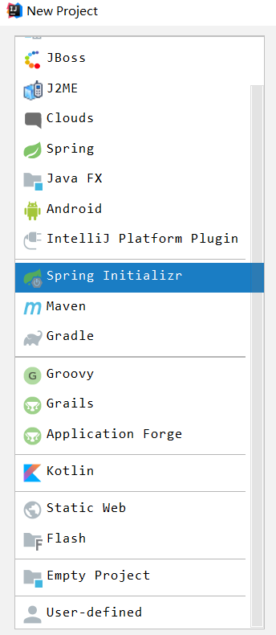

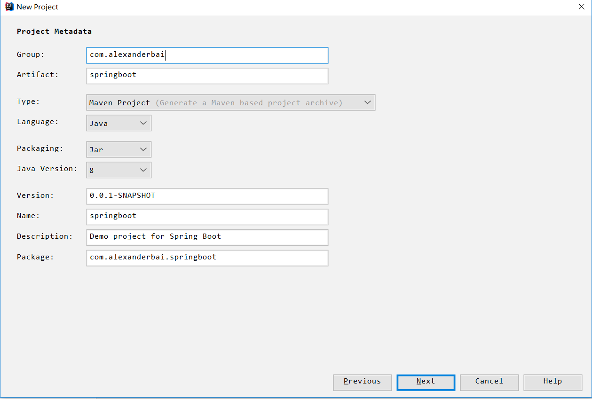

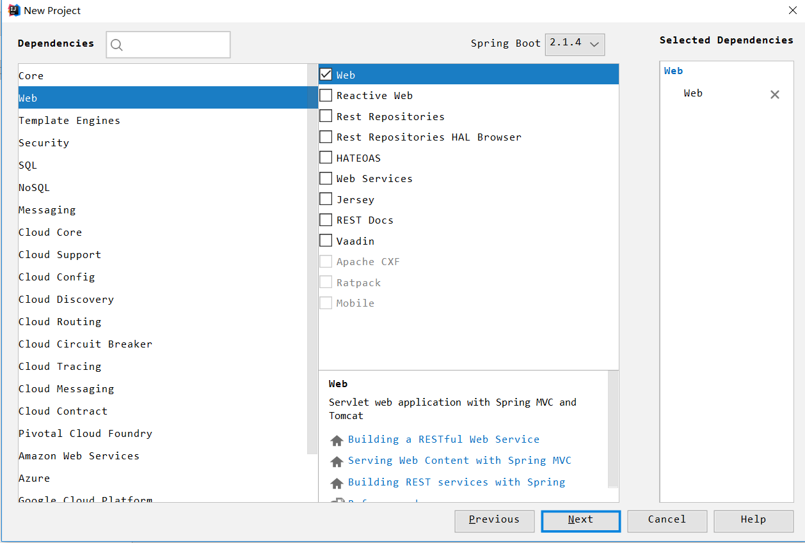

最后Spring Boot项目创建成功

项目目录

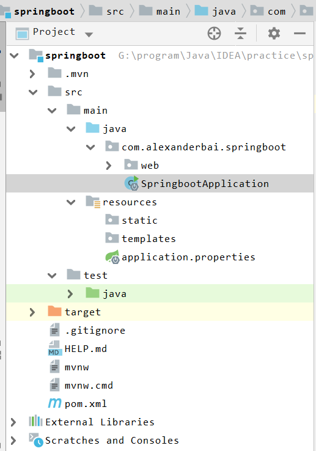

- src/main/java目录为源码文件，其中的SpringbootApplication是程序的入口
- src/main/resources是配置文件
- src/main/test是测试文件
- pom.xml项目依赖

在com.alexanderbai.springboot的基础上新建HelloControler类，也就是SpringMVC中的控制器

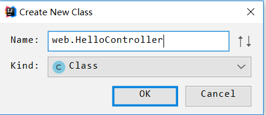


编写源码

- HelloControlle.java

```java
package com.alexanderbai.springboot.web;

import org.springframework.web.bind.annotation.RequestMapping;
import org.springframework.web.bind.annotation.RestController;

/**
 * @Description TODO
 * @Author AlexanderBai
 * @Data 2019/4/26 9:31
 **/
@RestController//是@ResponseBody和@Controller的缩写，表示是一个控制器
public class HelloController {
    @RequestMapping("/Hello")//请求路径匹配
    public String sayHello() {
        return "Hello Spring Boot!!";
    }
}
```

- SpringbootApplication.java

```java
package com.alexanderbai.springboot;

import org.springframework.boot.SpringApplication;
import org.springframework.boot.autoconfigure.SpringBootApplication;

@SpringBootApplication//表示是一个Spring Boot项目
public class SpringbootApplication {

    public static void main(String[] args) {
        SpringApplication.run(SpringbootApplication.class, args);
    }
}
```

- 直接运行main函数，Spring Boot是web项目，但是有main函数，是程序的入口，这也就是不需要手动部署到Tomcat，因为Spring Boot项目内置了Tomcat

  - 控制台输出如下，标明Spring Boot应用启动成功

    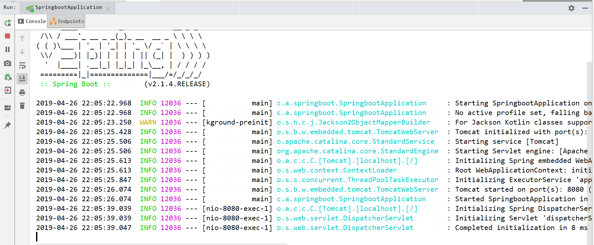

  - 浏览器访问，注意访问地址：本机+端口号+直接加请求路径（不需要项目名）

    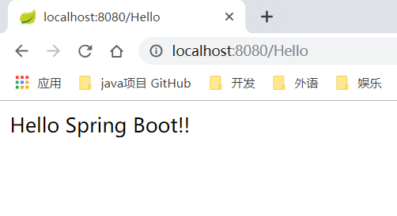
    
#### 3、Spring Boot部署

######（1）、-jar方式

- 运行Windows的命令行，切换至项目的跟目录
- -运行mvn命令
- 运行java -jar命令


①运行Windows的命令行，切换至项目的跟目录

```
G:\program\Java\IDEA\practice\springboot>
```

②运行mvn命令

```
G:\program\Java\IDEA\practice\springboot>mvn install
```

此时会生成项目对应的jar

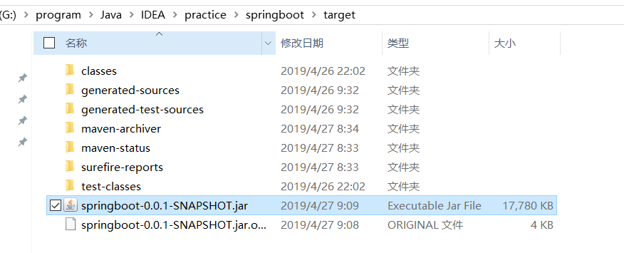

解压可以查看内面的内容,发现有上文件夹：BOOT-INF，META-INF，org

META-INF文件夹下有一个**MANIFEST.MF**文件，该文件指明了程序的入口以及版本信息等内容

```makefile
Manifest-Version: 1.0
Implementation-Title: springboot
Implementation-Version: 0.0.1-SNAPSHOT
Built-By: AlexanderBai
Implementation-Vendor-Id: com.alexanderbai
Spring-Boot-Version: 2.1.4.RELEASE
Main-Class: org.springframework.boot.loader.JarLauncher
Start-Class: com.alexanderbai.springboot.SpringbootApplication
Spring-Boot-Classes: BOOT-INF/classes/
Spring-Boot-Lib: BOOT-INF/lib/
Created-By: Apache Maven 3.5.0
Build-Jdk: 1.8.0_92
Implementation-URL: https://projects.spring.io/spring-boot/#/spring-bo
 ot-starter-parent/springboot
```

- **Main-Cl-ass**代表了Spring Boot中启动jar包的程序

- **Start-Class**属性就代表了Spring Boot程序的入口类，这个类中应该有一个main方法

- **Spring-Boot-Classes**代表了类的路径，所有编译后的class文件，以及配置文件，都存储在该路径下

- **Spring-Boot-Lib**表示依赖的jar包存储的位置

③运行java -jar命令

```
G:\program\Java\IDEA\practice\springboot>java -jar target/springboot-0.0.1-SNAPSHOT.jar
```

这样把jar上传的到服务器并运行即可达到部署的效果 

######（2）、war方式

- 修改SpringbootApplication
- 修改pom.xml文件
- 创建war包

- 重命名war包并部署

- 启动测试


①修改SpringbootApplication

- 新加@ServletComponent注解

- 继承SpringServletInitializer

  以上是规定，也就是要部署war包，就必须这么做

  ```java
  package com.alexanderbai.springboot;
  
  import org.springframework.boot.SpringApplication;
  import org.springframework.boot.autoconfigure.SpringBootApplication;
  import org.springframework.boot.web.servlet.ServletComponentScan;
  import org.springframework.boot.web.servlet.support.SpringBootServletInitializer;
  
  @SpringBootApplication
  @ServletComponentScan
  public class SpringbootApplication extends SpringBootServletInitializer {
  
      public static void main(String[] args) {
          SpringApplication.run(SpringbootApplication.class, args);
      }
  }
  ```

②修改pom.xml文件

- 新加打包成war的声明

  ```xml
  <packaging>war</packaging>
  ```

- spring-boot-starter-tomcat修改为 provided方式，以避免和独立的Tomcat容器冲突

  ```xml
  <dependency>
       <groupId>org.springframework.boot</groupId>
       <artifactId>spring-boot-starter-tomcat</artifactId>
       <scope>provided</scope>
  </dependency>
  ```

- pom.xml文件

```xml
<?xml version="1.0" encoding="UTF-8"?>
<project xmlns="http://maven.apache.org/POM/4.0.0" xmlns:xsi="http://www.w3.org/2001/XMLSchema-instance"
         xsi:schemaLocation="http://maven.apache.org/POM/4.0.0 http://maven.apache.org/xsd/maven-4.0.0.xsd">
    <modelVersion>4.0.0</modelVersion>
    <parent>
        <groupId>org.springframework.boot</groupId>
        <artifactId>spring-boot-starter-parent</artifactId>
        <version>2.1.4.RELEASE</version>
        <relativePath/> <!-- lookup parent from repository -->
    </parent>
    <groupId>com.alexanderbai</groupId>
    <artifactId>springboot</artifactId>
    <version>0.0.1-SNAPSHOT</version>
    <name>springboot</name>
    <description>Demo project for Spring Boot</description>
    <packaging>war</packaging>

    <dependencies>
        <dependency>
            <groupId>org.springframework.boot</groupId>
            <artifactId>spring-boot-starter-web</artifactId>
        </dependency>

        <dependency>
            <groupId>org.springframework.boot</groupId>
            <artifactId>spring-boot-starter-tomcat</artifactId>
            <scope>provided</scope>
        </dependency>

        <dependency>
            <groupId>org.springframework.boot</groupId>
            <artifactId>spring-boot-starter-test</artifactId>
            <scope>test</scope>
        </dependency>
    </dependencies>

    <build>
        <plugins>
            <plugin>
                <groupId>org.apache.maven.plugins</groupId>
                <artifactId>maven-compiler-plugin</artifactId>
                <executions>
                    <execution>
                        <id>compile</id>
                        <phase>compile</phase>
                        <goals>
                            <goal>compile</goal>
                        </goals>
                    </execution>
                    <execution>
                        <id>testCompile</id>
                        <phase>test-compile</phase>
                        <goals>
                            <goal>testCompile</goal>
                        </goals>
                    </execution>
                </executions>
            </plugin>

            <plugin>
                <groupId>org.springframework.boot</groupId>
                <artifactId>spring-boot-maven-plugin</artifactId>
            </plugin>
        </plugins>
    </build>
</project>
```

③创建war包

在Windows命令行运行mvn命令

```
G:\program\Java\IDEA\practice\springboot>mvn clean package
```

这样在target目录下就生成了一个war包

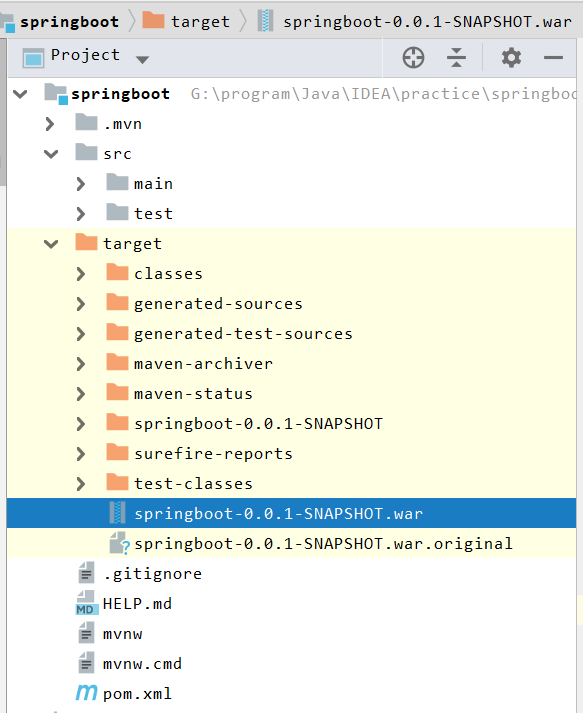


④重命名war包并部署

重命名为ROOT，这样在浏览器访问的时候就不需要写war包名（当使用使用原生的war包的时候访问路径要加上war包名）并把这个war包放到Tomcat的webapps目录下

- <font color=red>-重命名为ROOT.war并不是指访问路径为`http://localhost:8080/ROOTHello`,这里的ROOT表示根路径</font>

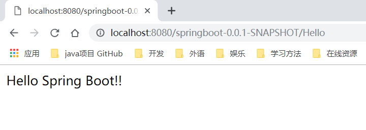


⑤启动测试

- 启动Tomcat

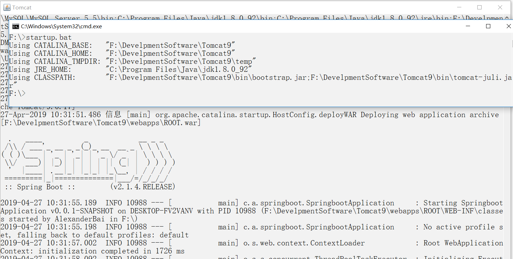

- 浏览器访问

​    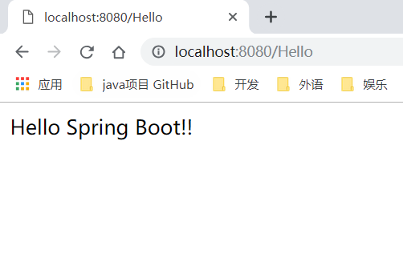

亲测以上两种访问方式不能同存，除非控制器所拦截的请求路径不一样

如图"**/Hello**"和"**/hello**"

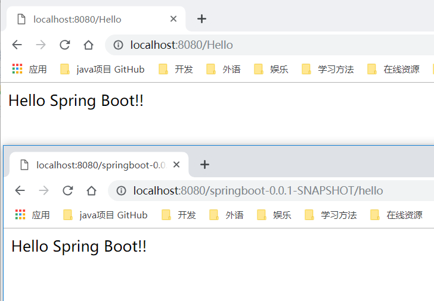

#### 4、Spring Boot JSP

- 修改pom.xml配置文件
- 增加application.properties文件
- 修改控制器
- 编写jsp文件
- 启动测试


在编写Spring Boot JSP之前先清除所有的Artfacts,不然会包各种错

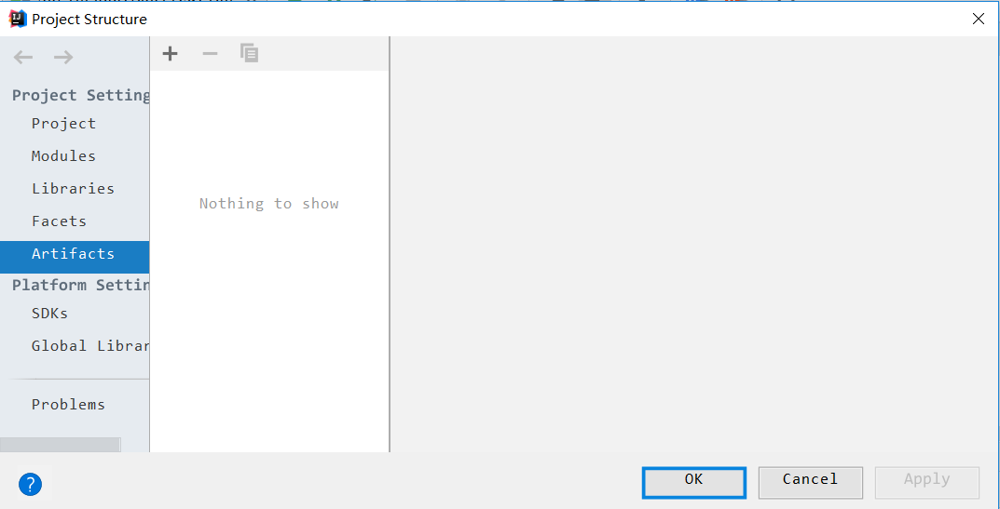

整个项目的目录结构

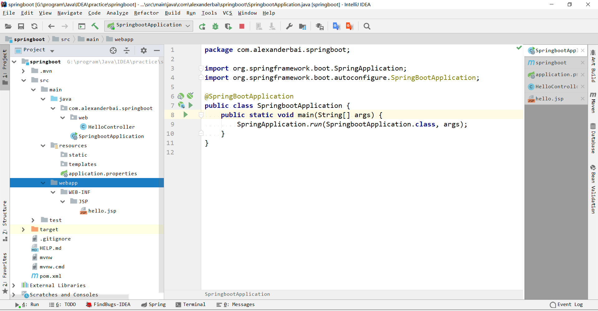

①在pom.xml中**增加对Servlet（jsp是一种servlet)和Tomcat的依赖**

```xml
		<!--Servlet依赖-->
        <dependency>
            <groupId>javax.servlet</groupId>
            <artifactId>servlet-api</artifactId>
            <version>3.0</version>
        </dependency>
        <dependency>
            <groupId>javax.servlet.jsp.jstl</groupId>
            <artifactId>jstl-api</artifactId>
            <version>1.2</version>
        </dependency>

        <!--Tomcat支持-->
        <dependency>
            <groupId>org.apache.tomcat.embed</groupId>
            <artifactId>tomcat-embed-jasper</artifactId>
        </dependency>		
```

②在resources目录下**增加application.properties**文件，用于说明视图重定向jsp文件的位置

- 前缀，其实就是说明目录
- 后缀，其实就是说明文件类型

```properties
spring.mvc.view.prefix=/WEB-INF/JSP/
spring.mvc.view.suffix=.jsp
```

③修改控制器，使之重定向于jsp文件

- 把原来的@RestController改为@Controller，也就是把之前集控制与视图显示（返回字符串）的功能中移除视图显示（由下一步的jsp文件负责视图的显示）

````java
package com.alexanderbai.springboot.web;

import org.springframework.stereotype.Controller;
import org.springframework.ui.Model;
import org.springframework.web.bind.annotation.RequestMapping;

import java.text.DateFormat;
import java.util.Date;

/**
 * @Description 实质上是Spring MVC中的控制器
 * @Author AlexanderBai
 * @Data 2019/4/26 9:31
 **/
@Controller
public class HelloController {
    @RequestMapping("/hello")
    public String sayHello(Model model) {
        model.addAttribute("now", DateFormat.getDateTimeInstance().format(new Date()));
        return "hello";
    }
}
````

- **<font color=red>此时返回的不再是字符串hello，而是根据application.properties中的视图重定向，到/WEB-INF/JSP中寻找jsp文件</font>**

④新建jsp文件

```jsp
<%@ page language="java" contentType="text/html; charset=UTF-8"
         pageEncoding="UTF-8"%>
Hi JSP. 现在时间是  ${now}
```

⑤测试

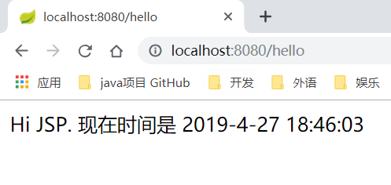

#### 5、Spring Boot热部署

所谓的热部署就是实时、动态地更新。当程序发生改变时，JVM会重新加载程序

修改pom.xml文件以至于能支持热部署(其实实质上很是自动重启了Tomcat，只不过是透明的，避免了之前复杂的手动重启方式)

- 添加一个依赖

  ```xml
  <dependency>
       <groupId>org.springframework.boot</groupId>
        <artifactId>spring-boot-devtools</artifactId>
        <optional>true</optional>   <!--这个需要为true热部署才有效-->
  </dependency>
  ```

- 添加一个插件

  ```xml
  <groupId>org.springframework.boot</groupId>
       <artifactId>spring-boot-maven-plugin</artifactId>
  </plugin>
  ```

- 在application.properties中添加以下内容

  ```properties
  #热部署
  #1、缓存
  spring.thymeleaf.cache=true        
  #2、开启热部署
  spring.devtools.restart.enabled=true   
  #3、监听目录,也就是会监听指定目录下文件的变动
  spring.devtools.restart.additional-paths=src/main/java  
  ```
- **运行，在运行过程中修改控制器，可以观察到控制台自动重启**


#### 6、Spring Boot全局错误处理

①在控制器中增加代码，是程序一定会出错

- 修改控制器，使访问一定能产生一个错误（为了便于演示）
- 增加一个全局异常处理器
- 增加一个用于显示异常信息的jsp页面

  ```java
package com.alexanderbai.springboot.web;

import org.springframework.stereotype.Controller;
import org.springframework.ui.Model;
import org.springframework.web.bind.annotation.RequestMapping;

import java.text.DateFormat;
import java.util.Date;

/**
 * @Description 实质上是Spring MVC中的控制器
 * @Author AlexanderBai
 * @Data 2019/4/26 9:31
 **/
@Controller
public class HelloController {
    @RequestMapping("/hello")
    public String sayHello(Model model) throws Exception {
        model.addAttribute("now", DateFormat.getDateTimeInstance().format(new Date()));
        if (true) {//if语句为永真
            throw new Exception("some exception");
        }
        return "hello";
    }
}
  ```

②新建GlobalExceptionHandler类，用于处理全局错误

- 捕捉Exception或是其子类异常
- 把异常放入ModelAndView对象中
- 跳转到errorPage页面

```java
package com.alexanderbai.springboot.exception;

import org.springframework.web.bind.annotation.ControllerAdvice;
import org.springframework.web.bind.annotation.ExceptionHandler;
import org.springframework.web.servlet.ModelAndView;

import javax.servlet.http.HttpServletRequest;

/**
 * @Description 全局异常处理器
 * @Author AlexanderBai
 * @Data 2019/4/27 19:31
 **/
@ControllerAdvice
public class GlobalExceptionHandler {
    @ExceptionHandler(value = Exception.class)
    public ModelAndView defaultErrorHandler(HttpServletRequest request,Exception e) {
        ModelAndView modelAndView = new ModelAndView();
        modelAndView.addObject("exception",e);
        modelAndView.addObject("url", request.getRequestURL());
        modelAndView.setViewName("errorPage");
        return modelAndView;
    }
}
```

③显示异常信息页面

```jsp
<%--
  Created by IntelliJ IDEA.
  User: AlexanderBai
  Date: 2019/4/27
  Time: 19:40
  To change this template use File | Settings | File Templates.
--%>
<%@ page contentType="text/html;charset=UTF-8" language="java" %>
<html>
<head>
    <title>error page</title>
</head>
<body>
    <div style="width: 500px;border: 1px solid lightgray;margin:200px auto;padding: 80px">
        系统 出现了异常，原因是：
        ${exception}
        <br><br>
        出现异常的地址是：
        ${url}
    </div>
</body>
</html>
```

测试效果

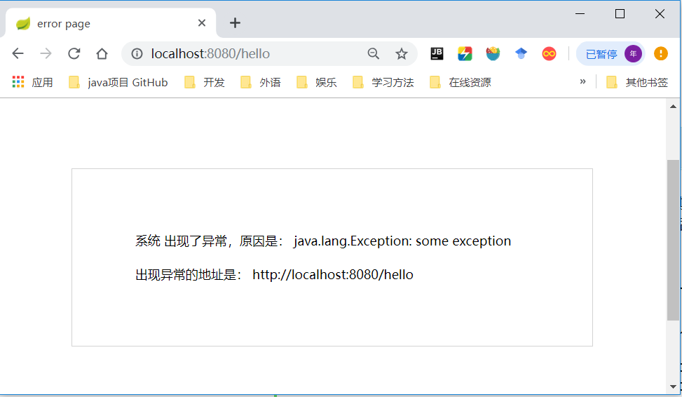

#### 7、Spring Boot端口和上下文路径

可以通过修改application.properties来实现对访问端口和路径的设置

```properties
#修改端口
server.port=8888
```


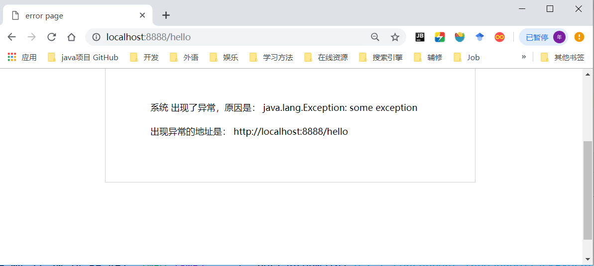

```properties
#修改上下文路径
server.servlet.context-path=/test
```


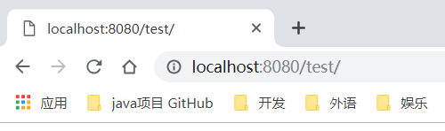

#### 8、Spring Boot配置切换

**有时候在本地测试的时候用的是8080端口，可是上线使用的是80端口，此时可通过多配置文件或在部署时设定参数，来实现灵活切换**

###### （1）、多配置文件方式

三个配置文件

- 核心文件：application.properties

- 开发环境用的配置文件：application-dev.properties

- 生成环境用的配置文件:application-pro.properties

  这样就可以在application.properties里的spring.profiles.active灵活地设置使用哪个环境

  - application.properties

  ```properties
  spring.mvc.view.prefix=/WEB-INF/jsp/
  spring.mvc.view.suffix=.jsp
  spring.profiles.active=pro
  ```

  - application-dev.properties

  ```properties
  server.port=8080
  server.context-path=/test
  ```

  - application-pro.properties

  ```properties
  server.port=80
  server.context-path=/
  ```

######（2）部署方式

在部署环境下设置指定的参数，实现灵活的切换

- 运行mvn命令

  ```
  G:\program\Java\IDEA\practice\springboot>mvn install
  ```

- 运行java命令

  ```
  G:\program\Java\IDEA\practice\springboot>java -jar target/springboot-0.0.1-SNAPSHOT.jar --spring.profiles.active=pro
  ```

  或是

  ```
  G:\program\Java\IDEA\practice\springboot>java -jar target/springboot-0.0.1-SNAPSHOT.jar --spring.profiles.active=dev
  ```

  

####9、Spring Boot yml文件

（这小节s了解看得懂即可）

在Spring Boot除了可以使用.properties配置文件外，Spring Boot还支持yml格式

```yml
spring:
  mvc:
    view:
      prefix: /WEB-INF/JSP/
      suffix: .jsp
server:
  port: 8888
  servlet:
    context-path: /test
```

此时浏览器访问路径如下

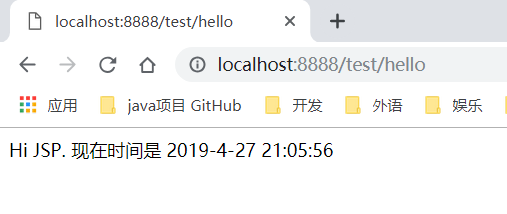


##二、持久层支持

#### 1、Spring Boot JPA

- JPA的概念
- 创建数据库、表、字段
- 修改application.properties
- 在pom.xml中添加依赖
- 新建一个实体类
- 新建DAO接口
- 新建对应的控制器
- 视图页面
- 测试


①JPA的概念

- JPA（Java Persistence API）：由Sun官方提出的Java持久化规范，也就是帮助开发人员操作数据库。默认使用的是Hibernate
- 在实际开发中，真正干活的是实现了JPA规范的框架，如Mybatis
- 通俗地说，JPA是官方给的规范，而Hibernate实现了这个JPA规范，所以官方默认使用的是Hibernate，但就现在而言，在实际开发中，主流的还是使用同样实现了JPA规范的Mybatis

②创建数据库、表字段

```sql
create database test;

use test;
CREATE TABLE category(
  id int(11) NOT NULL AUTO_INCREMENT,
  name varchar(30),
  PRIMARY KEY (id)
) DEFAULT CHARSET=UTF8;

insert into category values
        (null,'category 1'),
        (null,'category 2'),
        (null,'category 3'),
        (null,'category 4');
```

③在application.properties设置相关的属性

- jsp视图定位
- 数据库连接的相关属性
- 热部署（可选）

```properties
#jsp视图定位
spring.mvc.view.prefix=/WEB-INF/JSP/
spring.mvc.view.suffix=.jsp


#连接数据库
spring.dataSource.url=jdbc:mysql://127.0.0.1:3306/test?characterEncoding=utf-8
spring.datasource.driver-class-name=com.mysql.jdbc.Driver
spring.datasource.username=root
spring.datasource.password=ROOT
spring.jpa.properties.hibernate.hbm2dd1.auto=update
#spring.jpa.properties.hibernate.hbm2dd1.auto=update表示会自动更新数据表


#热部署
#1、缓存
spring.thymeleaf.cache=true        
#2、开启
spring.devtools.restart.enabled=true   
#3、监听目录
spring.devtools.restart.additional-paths=src/main/java  
```

④在pom.xml中添加依赖

- 增加对MySQL的依赖
- 增加对JPA的依赖

```xml
<?xml version="1.0" encoding="UTF-8"?>
<project xmlns="http://maven.apache.org/POM/4.0.0" xmlns:xsi="http://www.w3.org/2001/XMLSchema-instance"
         xsi:schemaLocation="http://maven.apache.org/POM/4.0.0 http://maven.apache.org/xsd/maven-4.0.0.xsd">
    <modelVersion>4.0.0</modelVersion>
    <parent>
        <groupId>org.springframework.boot</groupId>
        <artifactId>spring-boot-starter-parent</artifactId>
        <version>2.1.4.RELEASE</version>
        <relativePath/> <!-- lookup parent from repository -->
    </parent>
    <groupId>com.alexanderbai</groupId>
    <artifactId>springboot</artifactId>
    <version>0.0.1-SNAPSHOT</version>
    <name>springboot</name>
    <description>Demo project for Spring Boot</description>
    <packaging>war</packaging>

    <dependencies>
        <dependency>
            <groupId>org.springframework.boot</groupId>
            <artifactId>spring-boot-starter-web</artifactId>
        </dependency>

        <dependency>
            <groupId>org.springframework.boot</groupId>
            <artifactId>spring-boot-starter-tomcat</artifactId>
            <scope>compile</scope>
        </dependency>

        <dependency>
            <groupId>org.springframework.boot</groupId>
            <artifactId>spring-boot-starter-test</artifactId>
            <scope>test</scope>
        </dependency>

        <!--Servlet(jsp是Servlet）依赖-->
        <dependency>
            <groupId>javax.servlet</groupId>
            <artifactId>servlet-api</artifactId>
            <version>3.0</version>
        </dependency>

        <!--JSTL依赖-->
        <dependency>
            <groupId>jstl</groupId>
            <artifactId>jstl</artifactId>
            <version>1.2</version>
        </dependency>

        <!--Tomcat支持-->
        <dependency>
            <groupId>org.apache.tomcat.embed</groupId>
            <artifactId>tomcat-embed-jasper</artifactId>
        </dependency>

        <dependency>
            <groupId>org.springframework.boot</groupId>
            <artifactId>spring-boot-devtools</artifactId>
            <optional>true</optional>   <!--这个需要为true热部署才有效-->
        </dependency>

        <!--MySQL依赖-->
        <dependency>
            <groupId>mysql</groupId>
            <artifactId>mysql-connector-java</artifactId>
            <version>5.1.43</version>
        </dependency>

        <!--JPA依赖-->
        <dependency>
            <groupId>org.springframework.boot</groupId>
            <artifactId>spring-boot-starter-data-jpa</artifactId>
        </dependency>
    </dependencies>

    <build>
        <plugins>
            <plugin>
                <groupId>org.apache.maven.plugins</groupId>
                <artifactId>maven-compiler-plugin</artifactId>
                <executions>
                    <execution>
                        <id>compile</id>
                        <phase>compile</phase>
                        <goals>
                            <goal>compile</goal>
                        </goals>
                    </execution>
                    <execution>
                        <id>testCompile</id>
                        <phase>test-compile</phase>
                        <goals>
                            <goal>testCompile</goal>
                        </goals>
                    </execution>
                </executions>
            </plugin>

            <plugin>
                <groupId>org.springframework.boot</groupId>
                <artifactId>spring-boot-maven-plugin</artifactId>
            </plugin>

        </plugins>
    </build>
</project>
```

⑤POJO

- **@Entity:表明这是一个实体类**
- **@Table(name = "category")：表明对应的数据表是category**
-  **@Id：表明主键**
- **@GeneratedValue(strategy= GenerationType.IDENTITY)：表明主键由数据库控制，即自增**
- **@Column(name = "id")：表明这是一个字段名为id的字段 ；@Column(name = "name")：表明这是一个字段名为name的字段**

```java
package com.alexanderbai.springboot.pojo;

import javax.persistence.*;

/**
 * @Description TODO
 * @Author AlexanderBai
 * @Data 2019/4/28 9:07
 **/
@Entity
@Table(name = "category")
public class Category {

    @Id
    @GeneratedValue(strategy= GenerationType.IDENTITY)
    @Column(name = "id")
    private Integer id;

    @Column(name = "name")
    private String name;

    public Integer getId() {
        return id;
    }

    public void setId(Integer id) {
        this.id = id;
    }

    public String getName() {
        return name;
    }

    public void setName(String name) {
        this.name = name;
    }
}
```

⑥编写实现了JPA规范的DAO接口

```java
package com.alexanderbai.springboot.dao;

import com.alexanderbai.springboot.pojo.Category;
import org.springframework.data.jpa.repository.JpaRepository;

/**
 * @Description TODO
 * @Author AlexanderBai
 * @Data 2019/4/28 9:13
 **/
public interface CategoryDAO extends JpaRepository<Category,Integer> {
}
```

- 泛型<Category,Integer>表示这个是针对Category类的DAO，Integer表示主键是Integer类型

- JpaRepository这个接口，提供了CRUD，分页等等一系列的数据库操作，可以直接使用

- 简单看一下JpaRepository的源码

  ```java
  @NoRepositoryBean
  public interface JpaRepository<T, ID> extends PagingAndSortingRepository<T, ID>, QueryByExampleExecutor<T> {
  ```

  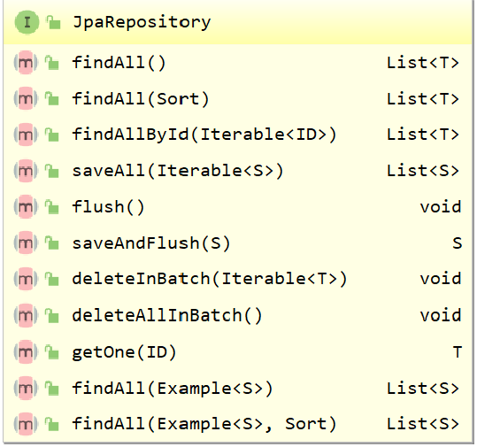

它的实现类

```java
@Repository
@Transactional(readOnly = true)
public class SimpleJpaRepository<T, ID> implements JpaRepositoryImplementation<T, ID> 
```

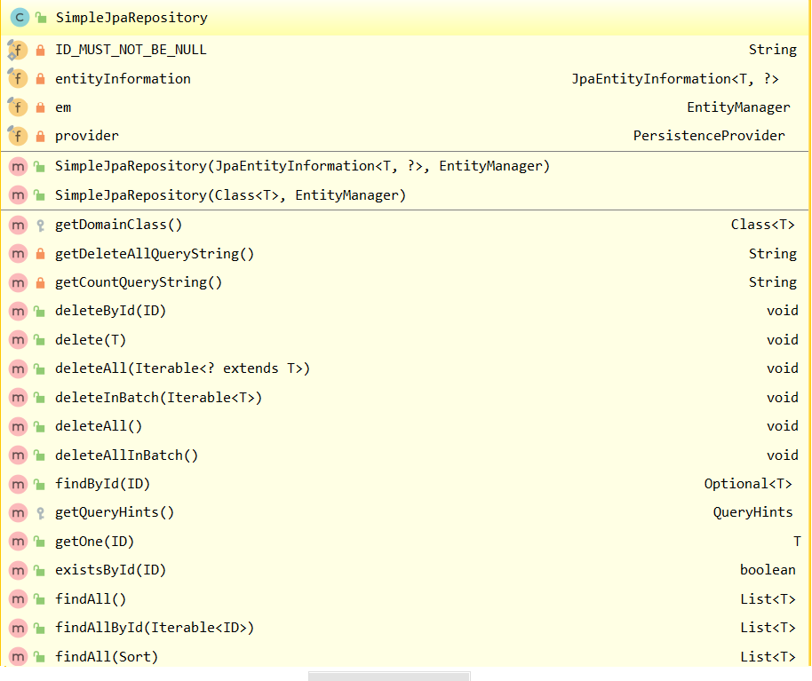

⑦建立对应的控制器

- 接受listCategory映射
- 获取所有的分类数据
- 接着放入Model中
- 跳转到listCategory.jsp

```java
package com.alexanderbai.springboot.web;

import com.alexanderbai.springboot.dao.CategoryDAO;
import com.alexanderbai.springboot.pojo.Category;
import org.springframework.beans.factory.annotation.Autowired;
import org.springframework.stereotype.Controller;
import org.springframework.ui.Model;
import org.springframework.web.bind.annotation.RequestMapping;

import java.util.List;

/**
 * @Description TODO
 * @Author AlexanderBai
 * @Data 2019/4/28 9:17
 **/
@Controller
public class CategoryController {
    @Autowired
    CategoryDAO categoryDAO;

    @RequestMapping("/listCategory")
    public String listCategory(Model model) {
        List<Category> categoryList = categoryDAO.findAll();
        model.addAttribute("categoryList", categoryList);
        return "listCategory";
    }
}
```

⑧视图页面

- 用JSTL遍历从CategoryController传递过来的集合：**categoryList**

```jsp
<%--
  Created by IntelliJ IDEA.
  User: AlexanderBai
  Date: 2019/4/28
  Time: 9:43
  To change this template use File | Settings | File Templates.
--%>
<%@ page contentType="text/html;charset=UTF-8" language="java" %>

<%@ taglib uri="http://java.sun.com/jsp/jstl/core" prefix="c" %>
<html>
<head>
    <title>list category page</title>
</head>
<body>
    <table align="center" border="1" cellspacing="0">
        <tr>
            <td>id</td>
            <td>name</td>
        </tr>
        <c:forEach items="${categoryList}" var="category" varStatus="st">
            <tr>
                <td>${category.id}</td>
                <td>${category.name}</td>
            </tr>
        </c:forEach>
    </table>
</body>
</html>
```

⑨测试

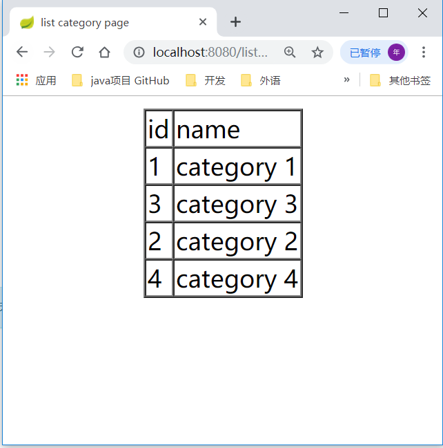


#### 2、Spring Boot MyBatis-注解方式

在上一节的基础上：

- 在pom,xml中添加依赖
- 修改实体POJO
- 新建CategoryMapper
- 修改控制器
- 测试


①在pom,xml中添加依赖

- 添加对MyBatis的依赖

```xml
<dependency>
    <groupId>org.mybatis.spring.boot</groupId>
    <artifactId>mybatis-spring-boot-starter</artifactId>
    <version>1.3.0</version>
</dependency>
```

②修改实体POJO

```java
package com.alexanderbai.springboot.pojo;

/**
 * @Description TODO
 * @Author AlexanderBai
 * @Data 2019/4/28 9:07
 **/

public class Category {
    private Integer id;
    private String name;

    public Integer getId() {
        return id;
    }

    public void setId(Integer id) {
        this.id = id;
    }

    public String getName() {
        return name;
    }

    public void setName(String name) {
        this.name = name;
    }
}
```

③新建CategoryMapper

- @Mapper:表明这是一个MyBatis的Mapper接口
- @Component：**表明把普通POJO实例化到Spring容器中，相当于配置文件中的`<bean id=" " class=" "/>`**
-  @Select:表明调用findAll方法时会去执行对应的SQL语句

```java
package com.alexanderbai.springboot.mapper;

import com.alexanderbai.springboot.pojo.Category;
import org.apache.ibatis.annotations.Mapper;
import org.apache.ibatis.annotations.Select;
import org.springframework.stereotype.Component;

import java.util.List;

/**
 * @Description TODO
 * @Author AlexanderBai
 * @Data 2019/4/28 11:35
 **/
@Mapper
@Component
public interface CategoryMapper {
    /**
     * 执行对应的SQL语句
     * @return List<Category>
     */
    @Select("select * from category")
    List<Category> findAll();
}
```

④修改控制器

- 接受listCategory映射
- 获取所有的分类数据
- 接着放入Model中
- 跳转到listCategory.jsp

```java
package com.alexanderbai.springboot.web;

import com.alexanderbai.springboot.mapper.CategoryMapper;
import com.alexanderbai.springboot.pojo.Category;
import org.springframework.beans.factory.annotation.Autowired;
import org.springframework.stereotype.Controller;
import org.springframework.ui.Model;
import org.springframework.web.bind.annotation.RequestMapping;

import java.util.List;

/**
 * @Description TODO
 * @Author AlexanderBai
 * @Data 2019/4/28 9:17
 **/
@Controller
public class CategoryController {
    @Autowired /**按类型自动装配bean */
    CategoryMapper categoryMapper;

    @RequestMapping("/listCategory")
    public String listCategory(Model model) {
        List<Category> categoryList = categoryMapper.findAll();
        model.addAttribute("categoryList", categoryList);
        return "listCategory";
    }
}
```

⑤测试

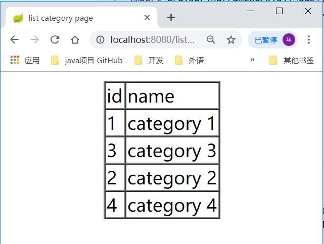

####3、Spring Boot MyBatis-XML方式

在原先的基础上：

- 修改CategoryMapper
- 新建Category.xml配置文件
- 修改application.properties文件
- 在pom.xml中添加资源依赖

①修改CategoryMapper

- 去掉了SQL的注解

```java
package com.alexanderbai.springboot.mapper;

import com.alexanderbai.springboot.pojo.Category;
import org.apache.ibatis.annotations.Mapper;
import org.springframework.stereotype.Component;

import java.util.List;

/**
 * @Description TODO
 * @Author AlexanderBai
 * @Data 2019/4/28 11:35
 **/
@Mapper
@Component
public interface CategoryMapper {
    /**
     * 执行对应的SQL语句
     * @return List<Category>
     */
    List<Category> findAll();
}
```

②新建Category.xml配置文件

- Mapper类同级目录下新建Mapper配置文件
- 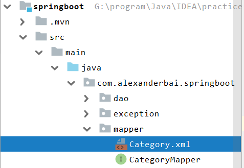

```xml
<?xml version="1.0" encoding="UTF-8"?>
<!DOCTYPE mapper
        PUBLIC "-//mybatis.org//DTD Mapper 3.0//EN"
        "http://mybatis.org/dtd/mybatis-3-mapper.dtd">

<mapper namespace="com.alexanderbai.springboot.mapper.CategoryMapper">
    <select id="findAll" resultType="com.alexanderbai.springboot.pojo.Category">
            select * from category
    </select>
</mapper>
```

③修改application.properties文件

- 指明去哪里查找xml配置文件，同时指定别名

```properties
mybatis.mapper-locations=classpath:com/alexanderbai/springboot/mapper/*.xml
mybatis.type-aliases-package=com.alexanderbai.springboot.pojo
```

④在pom.xml中添加资源依赖

- 指定在编译之后的字节码文件目录中，也生成需要的配置文件
- 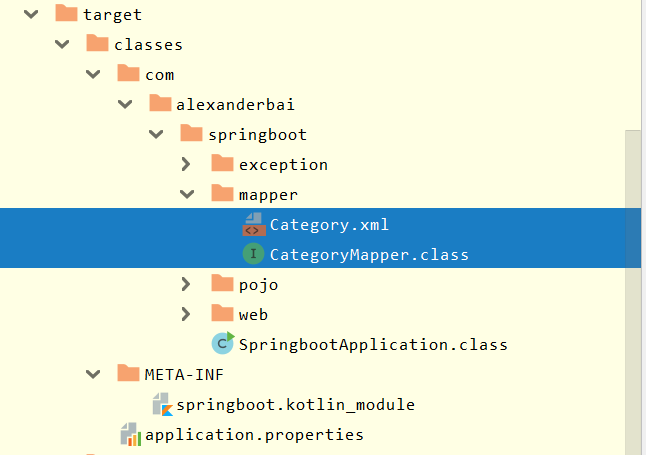

```xml
	<build>
        <resources>
            <resource>
                <directory>src/main/java</directory>
                <includes>
                    <include>**/*.xml</include>
                </includes>
            </resource>

            <resource>
                <directory>src/main/resources</directory>
            </resource>
        </resources>
    </build>
```


## 三、CRUD+分页


## 四、Thymeleaf


