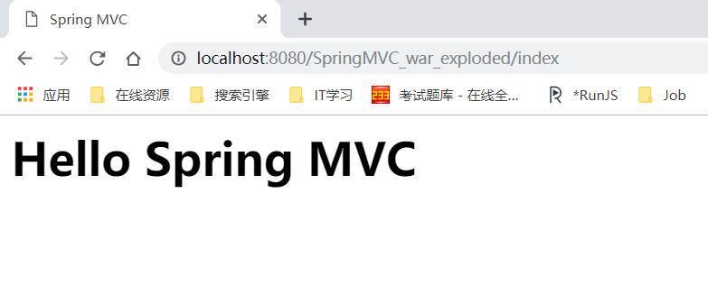

### 一、三层架构

- 软件开发架构一般有两种：C/S和B/S架构，而在JavaEE中几乎全部都是基于B/S架构的
- 在B/S架构中，系统标准的三层架构包括：<font color=red>表现层(web层)、业务层(service层)、持久层(dao层)</font>

####1、表现层

- 也就是我们常说的web层。负责接收客户端请求，向客户端响应结果，通常客户端使用http协议请求web层，web需要接收http请求，完成http响应。
- 表现层包括**展示层和控制层**：控制层负责接收请求，展示层负责结果的展示。
- 表现层依赖业务层，接收到客户端请求，一般会调用业务层进行业务处理，并将结果响应个客户端。
- 表现层的设计一般使用MVC模型。<font color=red>（MVC是表现层的设计模式，和其他层没有关系）</font>

#### 2、业务层

- 也就是我们常说的service层。负责业务逻辑处理，和开发项目的需求息息相关。表现层（web层）依赖业务层，但业务层不依赖表现层。
- 业务层在处理业务时可能会依赖持久层，如果要对数据持久化，需要保证事务一致性。（也就是说，事务应该放到业务层来控制）

####3、持久层

- 也就是常说的dao层。负责数据持久化，包括<font color=red>数据层（数据库）和数据访问层</font>。数据库是对数据进行持久化的载体，数据访问层是业务层和持久层交互的接口，业务需要通过数据访问层将数据持久化到数据库中。通俗地说，持久层就是和数据库打交道，对数据库表进行CRUD

上一个图

[相关博客](https://blog.csdn.net/hanxuemin12345/article/details/8544957)

### 二、MVC设计模式

**MVC** 全名是 Model View Controller，是**模型(model)－视图(view)－控制器(controller)**的缩写， 是一种用于设计创建 Web 应用程序<font color=red>表现层</font>的模式。

最常见的MVC实现`jsp+servlet+javabean`

####1、Model（模型）

- 模型包含**业务模型**和**数据模型**，数据模型用于封装数据，业务模型用于处理业务。

####2、View（视图）

- 通常指的就是我们的 JSP或者 HTML，作用一般就是展示数据的。

- 通常视图是依据模型数据创建的。

####3、Controller（控制器）

- 是应用程序中处理用户交互的部分。作用一般就是处理程序逻辑的

还是上图


### 三、Spring MVC

- Spring MVC就是实现了MVC设计模式的web框架，MVC设计模式是三层架构中表现层（web层）的实现模式

#### 1、Spring MVC原理

#####（1）、一个demo

- web.xml配置文件
  - **<font color=red>DispatcherServlet</font>：** 把所有的请求都提交给这个Servlet，这是Spring MVC的入口

```xml
<?xml version="1.0" encoding="UTF-8"?>
<web-app xmlns="http://xmlns.jcp.org/xml/ns/javaee"
         xmlns:xsi="http://www.w3.org/2001/XMLSchema-instance"
         xsi:schemaLocation="http://xmlns.jcp.org/xml/ns/javaee http://xmlns.jcp.org/xml/ns/javaee/web-app_4_0.xsd"
         version="4.0">

    <servlet>
        <servlet-name>springmvc</servlet-name>
        <servlet-class><!-- 把所有的请求都提交给这个Servlet，这是Spring MVC的入口-->
            org.springframework.web.servlet.DispatcherServlet
        </servlet-class>
        <load-on-startup>1</load-on-startup>
    </servlet>
    <servlet-mapping>
        <servlet-name>springmvc</servlet-name>
        <url-pattern>/</url-pattern>
    </servlet-mapping>

</web-app>
```

- 创建springmvc-servlet.xml配置文件
  - **<font color=red>springmvc-servlet</font>**.xml文件的格式必须是web.xml文件中的  **<servlet-name><font color=red>springmvc</font></servlet-name>**加上**<font color=red>`-servlet`</font>**。
  - 这是Spring MVC的映射配置文件

```xml
<?xml version="1.0" encoding="UTF-8"?>
<beans xmlns="http://www.springframework.org/schema/beans"
       xmlns:xsi="http://www.w3.org/2001/XMLSchema-instance"
       xsi:schemaLocation="http://www.springframework.org/schema/beans
       http://www.springframework.org/schema/beans/spring-beans.xsd">

    <beans>
        <!-- Spring创建一个bean，规定id值和类名-->
        <bean id="simpleServletHandlerAdapter"             		 			     
            class="org.springframework.web.servlet.handler.SimpleUrlHandlerMapping">
            <!-- 配置类SimpleUrlHandlerMapping下的属性mappings-->
            <property name="mappings">
                <!--使用props方式配置属性mappings-->
                <props>
                    <!-- 当访问路径为/index时，映射交给id为indexController的bean处理-->
                    <prop key="/index">indexController</prop>
                </props>
            </property>
        </bean>
        <!-- 给bean配置id值-->
        <bean id="indexController" class="controller.IndexController"></bean>
    </beans>

</beans>
```

- 控制类IndexController

  - 控制类需要实现**Controller接口**，提供方法**handleRequest**处理请求
  - SPring MVC通过ModelAndView对象把模型和视图结合在一起

  ```java
  package controller;
  
  import org.springframework.web.servlet.ModelAndView;
  import org.springframework.web.servlet.mvc.Controller;
  
  import javax.servlet.http.HttpServletRequest;
  import javax.servlet.http.HttpServletResponse;
  
  /**
   * @Description TODO
   * @Author AlexanderBai
   * @Data 2019/4/7 12:14
   * @Vision 1.0.0
   **/
  public class IndexController implements Controller {
  
      @Override
      public ModelAndView handleRequest(HttpServletRequest httpServletRequest, HttpServletResponse httpServletResponse)
              throws Exception {
          //表示视图是index.jsp
       	ModelAndView modelAndView = new ModelAndView("index.jsp");
          //模型数据是message，内容是“Hello Spring MVC”
       	modelAndView.addObject("message","Hello Spring MVC");
          return modelAndView;
      }
  }
  ```

- index.jsp

  ```jsp
  <%--
    Created by IntelliJ IDEA.
    User: AlexanderBai
    Date: 2019/4/7
    Time: 11:52
    To change this template use File | Settings | File Templates.
  --%>
  <%@ page contentType="text/html;charset=UTF-8" language="java" %>
  <html>
  <head>
      <title>Spring MVC</title>
  </head>
  <body>
      <h1>${message}</h1>	<%--打印模型数据message--%>
  </body>
  </html>
  ```

- 运行结果 

  

#####（2）、Spring MVC原理图


  

  [Spring MVC 原理](https://blog.csdn.net/jianyuerensheng/article/details/51258942#commentBox)

#### 2、Spring MVC视图定位

- 就是把视图文件按照某个格式约定在某个文件夹下

- 上一步使用的是**`ModelAndView modelAndView = new ModelAndView("index.jsp");`**，现在改用**`ModelAndView modelAndView = new ModelAndView("index");`**跳转打指定的文件中

- 修改springmvc-servlet.xml文件

  ```xml
  <?xml version="1.0" encoding="UTF-8"?>
  <beans xmlns="http://www.springframework.org/schema/beans"
         xmlns:xsi="http://www.w3.org/2001/XMLSchema-instance"
         xsi:schemaLocation="http://www.springframework.org/schema/beans
         http://www.springframework.org/schema/beans/spring-beans.xsd">
  
  
      <beans>
  		<!-- 规定视图解析器-->
          <bean id="viewResovler"
          class="org.springframework.web.servlet.view.InternalResourceViewResolver">
              <!-- 指定文件目录和文件后缀名-->
              <property name="prefix" value="/WEB-INF/page/"/>
              <property name="suffix" value=".jsp"/>
          </bean>
  
          <bean id="simpleServletHandlerAdapter"                                            class="org.springframework.web.servlet.handler.SimpleUrlHandlerMapping">
  
              <property name="mappings">
                  <props>
                      <prop key="/index">indexController</prop>
                  </props>
              </property>
  
          </bean>
          <bean id="indexController" class="controller.IndexController"></bean>
      </beans>
  
  </beans>
  ```

- 控制类IndexController

  ```java
  package controller;
  
  import org.springframework.web.servlet.ModelAndView;
  import org.springframework.web.servlet.mvc.Controller;
  
  import javax.servlet.http.HttpServletRequest;
  import javax.servlet.http.HttpServletResponse;
  
  /**
   * @Description TODO
   * @Author AlexanderBai
   * @Data 2019/4/7 12:14
   * @Vision 1.0.0
   **/
  public class IndexController implements Controller {
  
      @Override
      public ModelAndView handleRequest(HttpServletRequest httpServletRequest, HttpServletResponse httpServletResponse)
              throws Exception {
          ModelAndView modelAndView = new ModelAndView("index");
          modelAndView.addObject("message","Hello Spring MVC");
          return modelAndView;
      }
  }
  ```

- 在WEB-INF下新建一个page目录，并把index.jsp移至该目录下 

  

  

- 其余不变，可以得到同样的效果


#### 3、Spring MVC注解方式

- 修改控制类IndexController

```java
package controller;

import org.springframework.web.bind.annotation.RequestHeader;
import org.springframework.web.bind.annotation.RequestMapping;
import org.springframework.web.servlet.ModelAndView;
import org.springframework.web.servlet.mvc.Controller;

import javax.servlet.http.HttpServletRequest;
import javax.servlet.http.HttpServletResponse;

/**
 * @Description TODO
 * @Author AlexanderBai
 * @Data 2019/4/7 12:14
 * @Vision 1.0.0
 **/
@org.springframework.stereotype.Controller//表示该类是一个控制器
public class IndexController{//不再让IndexController实现Controller接口

    @RequestMapping("/index")//表示路径/index会映射到该方法上
    public ModelAndView handleRequest(HttpServletRequest httpServletRequest, HttpServletResponse httpServletResponse)
            throws Exception {
        ModelAndView modelAndView = new ModelAndView("index");
        modelAndView.addObject("message","Hello Spring MVC");
        return modelAndView;
    }
}
```

- 修改springmvc-servlet.xml文件

```xml
<?xml version="1.0" encoding="UTF-8"?>
<beans xmlns="http://www.springframework.org/schema/beans"
       xmlns:xsi="http://www.w3.org/2001/XMLSchema-instance"
       xmlns:context="http://www.springframework.org/schema/context"
       xsi:schemaLocation="http://www.springframework.org/schema/beans
       http://www.springframework.org/schema/beans/spring-beans.xsd http://www.springframework.org/schema/context http://www.springframework.org/schema/context/spring-context.xsd">


    <beans>
       <!-- 指定在controller包下查找有@Controller注解的类-->
        <context:component-scan base-package="controller"/>
        <bean id="viewResovler"
           class="org.springframework.web.servlet.view.InternalResourceViewResolver">
            <property name="prefix" value="/WEB-INF/page/"/>
            <property name="suffix" value=".jsp"/>
        </bean>

    </beans>
</beans>
```

- 同样的效果

  

#### 4、Spring MVC接收表单数据

- POJO

  ```java
  package pojo;
  
  /**
   * @Description TODO
   * @Author AlexanderBai
   * @Data 2019/4/7 17:30
   * @Vision 1.0.0
   **/
  public class Product {
      private int id;
      private String name;
      private float price;
  
      public int getId() {
          return id;
      }
  
      public void setId(int id) {
          this.id = id;
      }
  
      public String getName() {
          return name;
      }
  
      public void setName(String name) {
          this.name = name;
      }
  
      public float getPrice() {
          return price;
      }
  
      public void setPrice(float price) {
          this.price = price;
      }
  }
  ```

  

- 在web目录下新建一个addProduct.jsp文件

  ```jsp
  <%--
    Created by IntelliJ IDEA.
    User: AlexanderBai
    Date: 2019/4/7
    Time: 17:49
    To change this template use File | Settings | File Templates.
  --%>
  <%@ page contentType="text/html;charset=UTF-8" language="java" %>
  <html>
  <head>
      <title>addProduct.jsp</title>
  </head>
  <body>
  <form action="addProduct">
      产品名称：<input type="text" name="name" value=""></input><br/>
      产品价格：<input type="text" name="price" value=""></input><br/>
      <input type="submit" value="增加商品">
  
  </form>
  </body>
  </html>
  ```

- 控制器类ProductController

  ```java
  package controller;
  
  import org.springframework.stereotype.Controller;
  import org.springframework.web.bind.annotation.RequestMapping;
  import org.springframework.web.servlet.ModelAndView;
  import pojo.Product;
  
  /**
   * @Description TODO
   * @Author AlexanderBai
   * @Data 2019/4/7 17:53
   * @Vision 1.0.0
   **/
  @Controller
  public class ProductController {
      @RequestMapping("/addProduct")//表示路径/addProduct会映射到该方法上
      public ModelAndView add(Product product) {
          ModelAndView modelAndView = new ModelAndView("showProduct");
          return modelAndView;
      }
  }
  ```

- springmvc-servlet.xml配置文件

  ```xml
  <?xml version="1.0" encoding="UTF-8"?>
  <beans xmlns="http://www.springframework.org/schema/beans"
         xmlns:xsi="http://www.w3.org/2001/XMLSchema-instance"
         xmlns:context="http://www.springframework.org/schema/context"
         xsi:schemaLocation="http://www.springframework.org/schema/beans
         http://www.springframework.org/schema/beans/spring-beans.xsd http://www.springframework.org/schema/context http://www.springframework.org/schema/context/spring-context.xsd">
  
  
      <beans>
         <!-- 指定在controller包下查找有@Controller注解的类-->
          <context:component-scan base-package="controller"/>
          <bean id="viewResovler"
                class="org.springframework.web.servlet.view.InternalResourceViewResolver">
              <property name="prefix" value="/WEB-INF/page/"/>
              <property name="suffix" value=".jsp"/>
          </bean>
  
      </beans>
  </beans>
  ```

- 在WEB-INF/page下新建一个showProduct.jsp文件

```jsp
<%--
  Created by IntelliJ IDEA.
  User: AlexanderBai
  Date: 2019/4/7
  Time: 17:58
  To change this template use File | Settings | File Templates.
--%>
<%@ page contentType="text/html;charset=UTF-8" language="java" %>
<html>
<head>
    <title>showProduct.jsp</title>
</head>
<body>
    产品名称：${product.name}<br/>
    产品价格：${product.price}<br/>
</body>
</html>
```

- 项目目录结构

  

- 运行结果


#### 5、Spring MVC客户端跳转

之前的例子中，无论是/index跳转到index.jsp，还是addProduct跳转到showProduct.jsp，都是服务器端跳转

- 修改控制类IndexController

  - **映射/jump到jump()方法中**
  - **`redirect:/index`**表示从客户端跳转

  ```java
  package controller;
  
  import org.springframework.web.bind.annotation.RequestHeader;
  import org.springframework.web.bind.annotation.RequestMapping;
  import org.springframework.web.servlet.ModelAndView;
  import org.springframework.web.servlet.mvc.Controller;
  
  import javax.servlet.http.HttpServletRequest;
  import javax.servlet.http.HttpServletResponse;
  
  /**
   * @Description TODO
   * @Author AlexanderBai
   * @Data 2019/4/7 12:14
   * @Vision 1.0.0
   **/
  @org.springframework.stereotype.Controller//表示该类是一个控制器
  public class IndexController{//不再让IndexController实现Controller接口
  
      @RequestMapping("/index")//表示路径/index会映射到该方法上
      public ModelAndView handleRequest(HttpServletRequest httpServletRequest, HttpServletResponse httpServletResponse)
              throws Exception {
          ModelAndView modelAndView = new ModelAndView("index");
          modelAndView.addObject("message","Hello Spring MVC");
          return modelAndView;
      }
  
      @RequestMapping("/jump")//映射 /jump 到jump()方法中
      public ModelAndView jump(){
          //redirect:/index表示从客户端跳转
          ModelAndView modelAndView = new ModelAndView("redirect:/index");
          return modelAndView;
      }
  }
  ```

- springmvc-servlet.xml文件

  ```xml
  <?xml version="1.0" encoding="UTF-8"?>
  <beans xmlns="http://www.springframework.org/schema/beans"
         xmlns:xsi="http://www.w3.org/2001/XMLSchema-instance"
         xmlns:context="http://www.springframework.org/schema/context"
         xsi:schemaLocation="http://www.springframework.org/schema/beans
         http://www.springframework.org/schema/beans/spring-beans.xsd http://www.springframework.org/schema/context http://www.springframework.org/schema/context/spring-context.xsd">
  
  
      <beans>
         <!-- 指定在controller包下查找有@Controller注解的类-->
          <context:component-scan base-package="controller"/>
          
          <bean id="viewResovler"    
          class="org.springframework.web.servlet.view.InternalResourceViewResolver">
              
              <property name="prefix" value="/WEB-INF/page/"/>
              <property name="suffix" value=".jsp"/>
          </bean>
  
      </beans>
  </beans>
  ```

- 运行结果

  访问URL从

  

  变为

  

#### 6、Spring MVC session

- 用session来记录访问次数

- 修改控制类IndexController

  ```java
  package controller;
  
  import org.springframework.web.bind.annotation.RequestHeader;
  import org.springframework.web.bind.annotation.RequestMapping;
  import org.springframework.web.servlet.ModelAndView;
  import org.springframework.web.servlet.mvc.Controller;
  
  import javax.servlet.http.HttpServletRequest;
  import javax.servlet.http.HttpServletResponse;
  import javax.servlet.http.HttpSession;
  
  /**
   * @Description TODO
   * @Author AlexanderBai
   * @Data 2019/4/7 12:14
   * @Vision 1.0.0
   **/
  @org.springframework.stereotype.Controller//表示该类是一个控制器
  public class IndexController{//不再让IndexController实现Controller接口
  
      @RequestMapping("/check")//表示路径/check会映射到该方法上
      //在check方法中提供HttpSession参数，这样在方法体中就可以使用session
      public ModelAndView check(HttpSession httpSession){
          Integer integer = (Integer) httpSession.getAttribute("count");
          if (integer==null) {
              integer = 0;
          }
          integer++;
          httpSession.setAttribute("count",integer);
          ModelAndView modelAndView = new ModelAndView("check");
          return modelAndView;
      }
  
  }
  ```

- 在page目录下新建一个check.jsp文件

  ```jsp 
  <%--
    Created by IntelliJ IDEA.
    User: AlexanderBai
    Date: 2019/4/7
    Time: 20:17
    To change this template use File | Settings | File Templates.
  --%>
  <%@ page contentType="text/html;charset=UTF-8" language="java" %>
  <html>
  <head>
      <title>check.jsp</title>
  </head>
  <body>
      httpSession中记录的次数：${count}
  </body>
  </html>
  
  ```

- springmvc-servlet.xml文件

  ```xml
  <?xml version="1.0" encoding="UTF-8"?>
  <beans xmlns="http://www.springframework.org/schema/beans"
         xmlns:xsi="http://www.w3.org/2001/XMLSchema-instance"
         xmlns:context="http://www.springframework.org/schema/context"
         xsi:schemaLocation="http://www.springframework.org/schema/beans
         http://www.springframework.org/schema/beans/spring-beans.xsd http://www.springframework.org/schema/context http://www.springframework.org/schema/context/spring-context.xsd">
  
  
      <beans>
         <!-- 指定在controller包下查找有@Controller注解的类-->
          <context:component-scan base-package="controller"/>
          
          <bean id="viewResovler"    
          class="org.springframework.web.servlet.view.InternalResourceViewResolver">
              
              <property name="prefix" value="/WEB-INF/page/"/>
              <property name="suffix" value=".jsp"/>
          </bean>
  
      </beans>
  </beans>
  ```

- 效果

  - 可以不停地刷新session中记录的访问次数

  

#### 7、Spring MVC中文问题

- <font color=red>其实Spring MVC处理中文问题是Filter处理中文问题的一层封装</font>

- 设置提交方式为post

  ```jsp
  <%--
    Created by IntelliJ IDEA.
    User: AlexanderBai
    Date: 2019/4/7
    Time: 17:49
    To change this template use File | Settings | File Templates.
  --%>
  <%@ page contentType="text/html;charset=UTF-8" language="java" %>
  <html>
  <head>
      <title>addProduct.jsp</title>
  </head>
  <body>
  <form action="addProduct" method="post">
      产品名称：<input type="text" name="name" value=""></input><br/>
      产品价格：<input type="text" name="price" value=""></input><br/>
      <input type="submit" value="增加商品">
  
  </form>
  </body>
  </html>
  ```

- 修改web.xml

  ```xml
  <?xml version="1.0" encoding="UTF-8"?>
  <web-app xmlns="http://xmlns.jcp.org/xml/ns/javaee"
           xmlns:xsi="http://www.w3.org/2001/XMLSchema-instance"
           xsi:schemaLocation="http://xmlns.jcp.org/xml/ns/javaee http://xmlns.jcp.org/xml/ns/javaee/web-app_4_0.xsd"
           version="4.0">
  
      <servlet>
          <servlet-name>springmvc</servlet-name>
          <servlet-class>
              org.springframework.web.servlet.DispatcherServlet
          </servlet-class>
          <load-on-startup>1</load-on-startup>
      </servlet>
      <servlet-mapping>
          <servlet-name>springmvc</servlet-name>
          <url-pattern>/</url-pattern>
      </servlet-mapping>
  
     <!-- 配置Spring MVC编码过滤器-->
      <filter>
          <filter-name>encodingFilter</filter-name>
          <filter-class>
              org.springframework.web.filter.CharacterEncodingFilter
          </filter-class>
  
          <!--设置过滤器中的属性值-->
          <init-param>
              <param-name>encoding</param-name>
              <param-value>UTF-8</param-value>
          </init-param>
  
          <!--启动过滤器-->
          <init-param>
              <param-name>forceEncoding</param-name>
              <param-value>true</param-value>
          </init-param>
      </filter>
  
      <!--过滤所有请求-->
      <filter-mapping>
          <filter-name>encodingFilter</filter-name>
          <url-pattern>/*</url-pattern>
      </filter-mapping>
  
  </web-app>
  ```

#### 8、Spring MVC上传文件

- 修改web.xml文

  >- 添加内容，配置允许访问jpg文件
  >
  >```xml
  ><!--配置允许访问jpg，并且必须加在springmvc的servlet之前-->
  ><servlet-mapping>
  >        <servlet-name>default</servlet-name>
  >        <url-pattern>*.jpg</url-pattern>
  >    </servlet-mapping>
  >```

  ```xml
  <?xml version="1.0" encoding="UTF-8"?>
  <web-app xmlns="http://xmlns.jcp.org/xml/ns/javaee"
           xmlns:xsi="http://www.w3.org/2001/XMLSchema-instance"
           xsi:schemaLocation="http://xmlns.jcp.org/xml/ns/javaee http://xmlns.jcp.org/xml/ns/javaee/web-app_4_0.xsd"
           version="4.0">
      
      <!--配置允许访问jpg，并且必须加在springmvc的servlet之前-->
      <servlet-mapping>
          <servlet-name>default</servlet-name>
          <url-pattern>*.jpg</url-pattern>
      </servlet-mapping>
  
      <servlet>
          <servlet-name>springmvc</servlet-name>
          <servlet-class>
              org.springframework.web.servlet.DispatcherServlet
          </servlet-class>
          <load-on-startup>1</load-on-startup>
      </servlet>
      <servlet-mapping>
          <servlet-name>springmvc</servlet-name>
          <url-pattern>/</url-pattern>
      </servlet-mapping>
  
     <!-- 配置Spring MVC编码过滤器-->
      <filter>
          <filter-name>filter</filter-name>
          <filter-class>org.springframework.web.filter.CharacterEncodingFilter</filter-class>
  
          <!--设置过滤器中的属性值-->
          <init-param>
              <param-name>encoding</param-name>
              <param-value>UTF-8</param-value>
          </init-param>
  
          <!--启动过滤器-->
          <init-param>
              <param-name>forceEncoding</param-name>
              <param-value>true</param-value>
          </init-param>
      </filter>
  
      <!--过滤所有请求-->
      <filter-mapping>
          <filter-name>filter</filter-name>
          <url-pattern>/*</url-pattern>
      </filter-mapping>
  
  </web-app>
  ```

- 修改springmvc-servlet.xml文件

  >- 添加内容，配置spring对文件上传功能的支持
  >
  >```xml
  ><bean id="multipartResolver"         		class="org.springframework.web.multipart.commons.CommonsMultipartResolver"/>
  >```

  ```xml
  <?xml version="1.0" encoding="UTF-8"?>
          <beans xmlns="http://www.springframework.org/schema/beans"
                 xmlns:xsi="http://www.w3.org/2001/XMLSchema-instance"
                 xmlns:context="http://www.springframework.org/schema/context"
                 xsi:schemaLocation="http://www.springframework.org/schema/beans
         http://www.springframework.org/schema/beans/spring-beans.xsd http://www.springframework.org/schema/context http://www.springframework.org/schema/context/spring-context.xsd">
  
  
              <beans>
                  <!-- 指定在controller包下查找有@Controller注解的类-->
                  <context:component-scan base-package="controller"/>
                  <bean id="viewResovler"            class="org.springframework.web.servlet.view.InternalResourceViewResolver">
                      <property name="prefix" value="/WEB-INF/page/"/>
                      <property name="suffix" value=".jsp"/>
                  </bean>
                  
                  <!--开放对文件上传功能的支持-->
                  <bean id="multipartResolver"         		class="org.springframework.web.multipart.commons.CommonsMultipartResolver"/>
  
      </beans>
  </beans>
  ```

- 新建upload.jsp

  >- <font color=red >`method="post"`</font>和<font color=red>`enctype="multipart/form-data"`</font>:规定了文件上传的规范，缺一不可
  >- <font color=red>`accept="image/*"`</font>：规定只能选择图片进行上传

  ```jsp
  <%--
    Created by IntelliJ IDEA.
    User: AlexanderBai
    Date: 2019/4/8
    Time: 13:19
    To change this template use File | Settings | File Templates.
  --%>
  <%@ page contentType="text/html;charset=UTF-8" language="java" %>
  <html>
  <head>
      <title>upload</title>
  </head>
  <body>
      <form method="post" action="uploadImage" enctype="multipart/form-data">
          选中图片：<input type="file" name="image" accept="image/*"/><br>
          <input type="submit" value="上传">
      </form>
  </body>
  </html>
  ```

- POJO

  >- 在UploadImageFile中封装MultipartFile的字段<font color=red>image</font>，用于接受页面的注入
  >- 这里的<font color=red>image</font>字段必须和上传页面upload.jsp中的image<input tyep="file" name="<font color=red>image</font> accept="image/*"/> 保持一致

  ```java
  package pojo;
  
  import org.springframework.web.multipart.MultipartFile;
  
  /**
   * @Description TODO
   * @Author AlexanderBai
   * @Data 2019/4/8 13:22
   * @Vision 1.0.0
   **/
  public class UploadImageFile {
      MultipartFile image;
  
      public MultipartFile getImage() {
          return image;
      }
  
      public void setImage(MultipartFile image) {
          this.image = image;
      }
  }
  ```

- 控制器类

  >- 准备方法upload映射路径/uploadImage
  >
  >- 方法的第二个参数UploadImageFile中已经注入好了image
  >
  >- 通过RandomStringUtils.randomAlphabetic(10)获取一个随机文件名，当用户上传相同的文件时，不至于覆盖
  >
  >- 根据request.getServletContext().getRealPath("/image")获取web目录下的image目录，用于保存上传的文件
  >
  >-  file.getImage().transferTo(newFile);
  >
  > - ```java
  >  /*	Transfer treceived file to the given destination file.
  >  @param dest the destination file (typically absolute)
  >  */
  >  ```
  >```
  >
  > - 复制文件，若是没有这一行，之前的文件是一个空的文件（内容为空),把对象file中的文件复制给newFile
  >
  >- 把生成的随机的文件名提交给视图
  >```

```java
package controller;

import org.apache.commons.lang.xwork.RandomStringUtils;
import org.springframework.stereotype.Controller;
import org.springframework.web.bind.annotation.RequestMapping;
import org.springframework.web.servlet.ModelAndView;
import pojo.UploadImageFile;

import javax.servlet.http.HttpServletRequest;
import java.io.File;
import java.io.IOException;

/**
 * @Description TODO
 * @Author AlexanderBai
 * @Data 2019/4/8 13:24
 * @Vision 1.0.0
 **/
@Controller
public class UploadController{

    @RequestMapping("/uploadImage")
    public ModelAndView upload(HttpServletRequest request, UploadImageFile file) throws IllegalStateException, IOException {
        String name=RandomStringUtils.randomAlphabetic(10);
        String newFileName = name + ".jpg";
        System.out.println(newFileName.length());//测试
        
//保存上传的文件，IDEA默认保存在out目录下，也就是保存字节码的根目录
        File newFile = new File(request.getServletContext().getRealPath("/image"), newFileName);
        System.out.println(newFile.getAbsolutePath());//测试

        newFile.getParentFile().mkdirs();
        file.getImage().transferTo(newFile);//复制文件，若是没有这一行，之前的文件是一个空的文件（内容为空),把对象file中的文件复制给newFile

        ModelAndView modelAndView = new ModelAndView("showUploadFile");
        modelAndView.addObject("imageName", newFile);
        return modelAndView;
    }
}
```

- showUploadFile.jsp
  - IDEA 下找不到图片的src路径，不知道是哪里的问题

```jsp
<%--
  Created by IntelliJ IDEA.
  User: AlexanderBai
  Date: 2019/4/8
  Time: 13:45
  To change this template use File | Settings | File Templates.
--%>
<%@ page contentType="text/html;charset=UTF-8" language="java" %>
<html>
<head>
    <title>showUploadFile</title>
</head>
<body>

    
</body>
</html>
```

#### 9、Spring MVC拦截器

可以说是基于<font color=red>视图定位</font>的应用

- 拦截器类

  ```java
  package interceptor;
  
  import org.springframework.web.servlet.ModelAndView;
  import org.springframework.web.servlet.handler.HandlerInterceptorAdapter;
  
  import javax.servlet.http.HttpServletRequest;
  import javax.servlet.http.HttpServletResponse;
  import java.util.Date;
  
  /**
   * @Description TODO
   * @Author AlexanderBai
   * @Data 2019/4/8 16:08
   * @Vision 1.0.0
   **/
  public class IndexInterceptor extends HandlerInterceptorAdapter {
  
      /**
       * 在业务处理请求之前被调用
       * 如果返回false<br>
       *     <li>从当前的拦截器往回执行所有拦截器的afterCompletion()，再退出拦截器链</li>
       * 如果返回true<br>
       *     <li>执行下一个拦截器，知道所有的拦截器都执行完毕</li>
       *     <li>再执行被拦截的Controller</li>
       *     <li>然后进入拦截器链，从最后一个拦截器往回执行postHandle()</li>
       *     <li>接着再从最后一个拦截器往回执行afterCompletion()</li>
       * @param request
       * @param response
       * @param handler
       * @return
       * @throws Exception
       */
      @Override
      public boolean preHandle(HttpServletRequest request, HttpServletResponse response, Object handler) throws Exception {
          System.out.println("preHandle()方法，在访问Controller之前被调用");
          return true;
      }
  
      /**
       * 在业务处理请求之后，生成视图之前执行的动作
       * 可在modelAndView中加入数据，比如当前时间
       * @param request
       * @param response
       * @param handler
       * @param modelAndView
       * @throws Exception
       */
      @Override
      public void postHandle(HttpServletRequest request, HttpServletResponse response, Object handler, ModelAndView modelAndView) throws Exception {
          System.out.println("postHandle()方法在访问Controller之后，访问视图之前被调用，可以注入一个时间到modelAndView中，用于后续视图演示");
          modelAndView.addObject("date", "由拦截器生成的时间：" + new Date());
      }
  
      /**
       * 在DispathServlet完全处理完请求后被调用，可用于清理资源等
       * 当有拦截器抛出异常时，会从当前拦截器往回执行所有拦截器的afterCompletion()
       * @param request
       * @param response
       * @param handler
       * @param ex
       * @throws Exception
       */
      @Override
      public void afterCompletion(HttpServletRequest request, HttpServletResponse response, Object handler, Exception ex) throws Exception {
          System.out.println("afterCompletion()方法在访问视图之后被掉用");
      }
  }
  ```

- 配置拦截器

  >- <font color=red>/**</font>表示拦截所有
  >
  >- <font color=red>/Demo/*</font>表示拦截/Demo路径下的所有
  >
  >- <font color=red>/index</font>表示对/index路径进行拦截
  >
  >

  ```xml
  <?xml version="1.0" encoding="UTF-8"?>
  <beans xmlns="http://www.springframework.org/schema/beans"
         xmlns:xsi="http://www.w3.org/2001/XMLSchema-instance"
         xmlns:context="http://www.springframework.org/schema/context"
         xmlns:mvc="http://www.springframework.org/schema/mvc"
         xsi:schemaLocation="http://www.springframework.org/schema/beans
         http://www.springframework.org/schema/beans/spring-beans.xsd http://www.springframework.org/schema/context http://www.springframework.org/schema/context/spring-context.xsd http://www.springframework.org/schema/mvc http://www.springframework.org/schema/mvc/spring-mvc.xsd">
  
  
              <beans>
                  <!-- 指定在controller包下查找有@Controller注解的类-->
                  <context:component-scan base-package="controller"/>
                  
                  <bean id="viewResovler"
       class="org.springframework.web.servlet.view.InternalResourceViewResolver">
                      <property name="prefix" value="/WEB-INF/page/"/>
                      <property name="suffix" value=".jsp"/>
                  </bean>
                  
                  <bean id="simpleServletHandlerAdapter"
            class="org.springframework.web.servlet.handler.SimpleUrlHandlerMapping">
  
                      <property name="mappings">
                          <props>
                              <prop key="/index">indexController</prop>
                          </props>
                      </property>
                  </bean>
                  
  				<bean id="indexController" 
                        class="controller.IndexController">
                  </bean>
                  
                  <!--对/index路径进行拦截-->
                  <mvc:interceptors>
                      <mvc:interceptor>
                          <mvc:mapping path="/index"/>
                          <!--定义在<mvc:interceptor>下面的表示对特殊请求才进行拦截-->
                          <bean class="interceptor.IndexInterceptor"/>
                      </mvc:interceptor>
                      <!-- 当设置多个拦截器时先按顺序调用preHandle方法，再逆序调用postHandle和afterCompletion方法-->
                  </mvc:interceptors>
  
      </beans>
  </beans>
  ```

- 控制器类

  ```java
  package controller;
  
  import org.springframework.web.bind.annotation.RequestHeader;
  import org.springframework.web.bind.annotation.RequestMapping;
  import org.springframework.web.servlet.ModelAndView;
  import org.springframework.web.servlet.mvc.Controller;
  
  import javax.servlet.http.HttpServletRequest;
  import javax.servlet.http.HttpServletResponse;
  import javax.servlet.http.HttpSession;
  
  /**
   * @Description TODO
   * @Author AlexanderBai
   * @Data 2019/4/7 12:14
   * @Vision 1.0.0
   **/
  @org.springframework.stereotype.Controller//表示该类是一个控制器
  public class IndexController{//不再让IndexController实现Controller接口
  
      @RequestMapping("/index")//表示路径/index会映射到该方法上
      public ModelAndView handleRequest(HttpServletRequest httpServletRequest, HttpServletResponse httpServletResponse)
              throws Exception {
          ModelAndView modelAndView = new ModelAndView("index");
          modelAndView.addObject("message","Hello Spring MVC");
          return modelAndView;
      }
  }
  ```

- 视图

```jsp
<%--
  Created by IntelliJ IDEA.
  User: AlexanderBai
  Date: 2019/4/7
  Time: 11:52
  To change this template use File | Settings | File Templates.
--%>
<%@ page contentType="text/html;charset=UTF-8" language="java" %>
<html>
  <head>
    <title>Spring MVC</title>
  </head>
  <body>

    <h1>${message}</h1> <%--打印模型数据message--%>
    <p>${date}</p>
  </body>
</html>
```

- 效果

  

