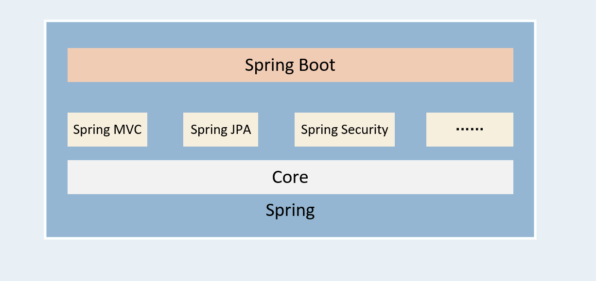
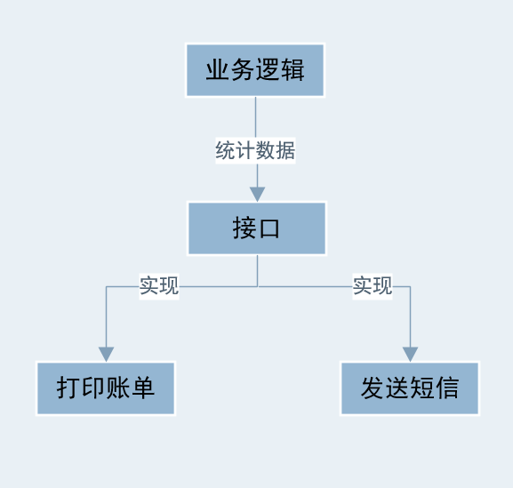
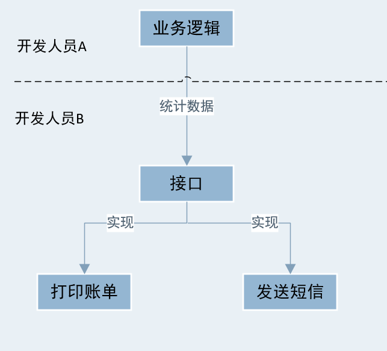
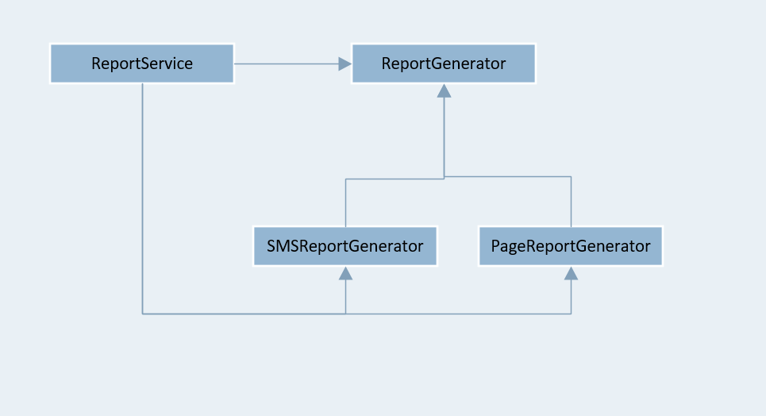
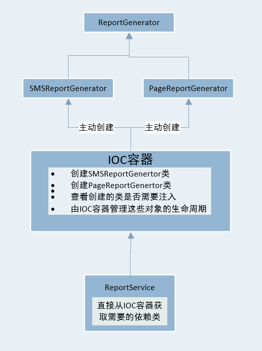
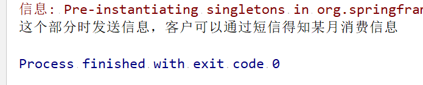
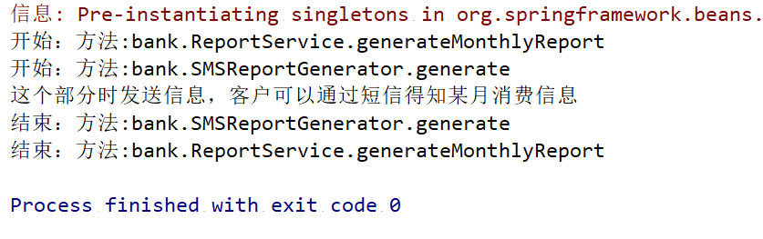

经常听说Spring的各种概念，Spring、 SpringMVC 、SpringBoot等等，上一张图，先不必了解具体的联系，知道长这个样子即可



### 一、Spring出现的背景

#### 1、一个简单的例子

>  假设有一个如下应用场景：
>
>​	（1）一个银行在每月的月初都需要向客户发送上个月的账单，账单发送的方式可以为纸质邮寄、或者短信方式。
>
>​	（2）还有一个潜在的需求：为了安全起见，在每个函数操作过程中都需要记录日志，记录参数传入是否正常，函数是否正常结束，以便出错时系统管理员查账。

- 画一个简单的系统框图



- 接口

  ```java
  package bank;
  
  public interface ReportGenerator {	
  	public void generate(String[][] table) ;	
  }
  ```

- 接口实现

```java
package bank;

public class SMSReportGenerator implements ReportGenerator {

	public void generate(String[][] table) {		
		System.out.println("假设这是一个日志:SMSReportGenerator.generate方法开始执行！");
		System.out.println("这个部分是打印报表，以便工作人员装进信封邮寄给客户");
		System.out.println("假设这是一个日志:SMSReportGenerator.generate方法执行完成！");
	}
}
```

```java
package bank;

public class PageReportGenerator implements ReportGenerator {
	public void generate(String[][] table) {
		System.out.println("假设这是一个日志:PageReportGenerator.generate方法开始执行！");
		System.out.println("这个部分是打印报表，以便工作人员以短信方式给客户");
		System.out.println("假设这是一个日志:PageReportGenerator.generate方法执行完成！");
	}
}
```

- 业务层

  ```java
  package bank;
  
  public class ReportService {	
  	private ReportGenerator reportGenerator = new SMSReportGenerator();
  	public void generateMonthlyReport(int year, int month) {
  		System.out.println("假设这是一个日志:ReportService.generateMonthlyReport方法开始执行！");
  		String[][] statistics = null ;
  		reportGenerator.generate(statistics);
  		
  		System.out.println("假设这是一个日志:ReportService.generateMonthlyReport方法执行完成！");
  	}
  }
  ```

- Main

  ```java
  package bank;
  
  public class Main {
  	public static void main(String[] args) {
  		ReportService reportService = new ReportService();
  		reportService.generateMonthlyReport(2011, 7);	
  	}	
  }
  ```

- 随着项目的扩大，以上程序需要分层开发

  

  **一般情况下开发人员是独立工作的，不存在依赖关系**

- 为程序画一个简单的UML依赖图

  

  - <font color=red>从图中可以看出业务层不仅依赖于接口还依赖于接口的实现</font>

    - 业务层需要的对象必须自己主动创建

      ```java
      private ReportGenerator reportGenerator = new SMSReportGenerator();
      ```

    - 同时当被依赖的对象（上述程序中的接口和接口的实现）发生改变时，依赖的对象（业务层对象）也要进行修正

    - 为了解决以上问题，引入了Spring  IOC和DI设计思想

####2、Spring 解决的功能

- 引入Spring之前，一个对象依赖于另一个对象，需要时主动创建（正转）
- <font color=red >引入Spring后，由Spring生产需要的对象，并注入给依赖的对象</font>




### 二、Spring  IOC和DI

####1、IOC和DI

- **Inversion Of Control（IOC）:**

  <font color=red >简单来说，就是之前开发人员通过new 来创建一个对象，交由Spring来创建对象。</font>

- **Dependency Inject（DI）：**

  <font color=red >就是由IOC容器在运行期间，动态地将某种依赖注入到对象之中。</font>

<font color=red size=6>使用Spring重写上面的小案例:</font>

- 接口

  ```java
  package bank;
  
  public interface ReportGenerator {
  	public void generate(String[][] table) ;
  }
  ```

- 接口实现

  ```java
  package bank;
  
  public class PageReportGenerator implements ReportGenerator {
  
  	public void generate(String[][] table) {
  		System.out.println("这个部分时发送信息，客户可以通过短信得知某月消费信息");
  	}
  }
  ```

  ```java
  package bank;
  
  public class SMSReportGenerator implements ReportGenerator {
  
  	public void generate(String[][] table) {
  		System.out.println("这个部分时发送信息，客户可以通过邮件得知某月消费信息");
  	}
  }
  ```

- 业务层

  ```java
  package bank;
  
  public class ReportService {
  	
  	private ReportGenerator reportGenerator;
  	
  	public void setReportGenerator(ReportGenerator reportGenerator){
  		this.reportGenerator = reportGenerator;
  	}
  
  	public void generateMonthlyReport(int year, int month) {
  		String[][] statistics = null ;
  		reportGenerator.generate(statistics);
  	}
  }
  ```

- Spring IOC 容器的XML配置

  >```xml
  ><?xml version="1.0" encoding="UTF-8"?>
  ><!--suppress ALL -->
  ><beans
  >	xmlns="http://www.springframework.org/schema/beans"
  >	xmlns:xsi="http://www.w3.org/2001/XMLSchema-instance"
  >	xmlns:p="http://www.springframework.org/schema/p"
  >	xmlns:aop="http://www.springframework.org/schema/aop"
  >	xsi:schemaLocation="http://www.springframework.org/schema/beans 
  >		http://www.springframework.org/schema/beans/spring-beans-3.0.xsd
  >		http://www.springframework.org/schema/aop
  >		http://www.springframework.org/schema/aop/spring-aop-3.0.xsd">
  >
  >	<bean id="smsReportGenerator" class="bank.SMSReportGenerator" />
  >	<bean id="reportService" class="bank.ReportService">
  >		<property name="reportGenerator" ref="smsReportGenerator" />
  >	</bean>
  ></beans>
  >```
  >
  >- 实例化一个`SMSReportGenerator`对象
  >- 实例化一个`ReportService`对象
  >  - 把`SMSReportGenerator`对象赋值给`ReportService`中的`reportGenerator`属性,完成依赖注入

- Main

  ```java
  package bank;
  
  import org.springframework.context.ApplicationContext;
  import org.springframework.context.support.ClassPathXmlApplicationContext;
  
  public class Main {
  	
  	public static void main(String[] args) {
  	
  		ApplicationContext context =
  				new ClassPathXmlApplicationContext("applicationContext.xml");
  		ReportService reportService = (ReportService)context.getBean("reportService");
  		reportService.generateMonthlyReport(2019, 7);
  	}
  }
  ```

- 运行结果

  

####2、IOC和DI的区别

<font color=red>其实IOC和DI是对同一概念从不同的角度进行阐述。IOC是指应用程序依赖于IOC容器，而DI是指IOC容器为应用程序注入所需的资源（包括对象、资源、常量数据）</font>

####3、Spring注解方式IOC和DI

#####（1）、注入对象行为的注解

- POJO

  - Category.java

  ```java
  package com.alexanderbai.pojo;
  
  /**
   * @Description TODO
   * @Author AlexanderBai
   * @Data 2019/4/5 15:14
   * @Vision 1.0.0
   */
  public class Category {
      private int id;
      private String name;
  
      public int getId() {
          return id;
      }
  
      public void setId(int id) {
          this.id = id;
      }
  
      public String getName() {
          return name;
      }
  
      public void setName(String name) {
          this.name = name;
      }
  }
  ```

- POJO
  - Product.java

  ```java
  package com.alexanderbai.pojo;
  
  import org.aspectj.lang.annotation.Around;
  import org.springframework.beans.factory.annotation.Autowired;
  
  /**
   * @Description TODO
   * @Author AlexanderBai
   * @Data 2019/4/5 15:14
   * @Vision 1.0.0
   */
  public class Product {
  
      private int id;
      private String name;
      @Autowired   //@Resource(name="c")也可起同样的效果
      private Category category;
  
      public int getId() {
          return id;
      }
  
      public void setId(int id) {
          this.id = id;
      }
  
      public String getName() {
          return name;
      }
  
      public void setName(String name) {
          this.name = name;
      }
  
      public Category getCategory() {
          return category;
      }
         // @Autowired  和在属性前加@Autowired起同样的效果
      public void setCategory(Category category) {
          this.category = category;
      }
  }
  ```

- Spring IOC 容器的XML配置

  ```xml
  <?xml version="1.0" encoding="UTF-8"?>
  <beans xmlns="http://www.springframework.org/schema/beans"
         xmlns:xsi="http://www.w3.org/2001/XMLSchema-instance"
         xmlns:aop="http://www.springframework.org/schema/aop"
         xmlns:tx="http://www.springframework.org/schema/tx"
         xmlns:context="http://www.springframework.org/schema/context"
         xsi:schemaLocation="
     http://www.springframework.org/schema/beans 
     http://www.springframework.org/schema/beans/spring-beans-3.0.xsd
     http://www.springframework.org/schema/aop 
     http://www.springframework.org/schema/aop/spring-aop-3.0.xsd
     http://www.springframework.org/schema/tx 
     http://www.springframework.org/schema/tx/spring-tx-3.0.xsd
     http://www.springframework.org/schema/context      
     http://www.springframework.org/schema/context/spring-context-3.0.xsd">
  
      <context:annotation-config/>   <!-- 告诉Spring要注解的方式进行配置-->
      <bean name="c" class="com.alexanderbai.pojo.Category">
          <property name="name" value="Category 1"/>
      </bean>
  
      <bean name="p" class="com.alexanderbai.pojo.Product">
          <property name="name" value="product 1"/>
      </bean>
      
  </beans>
  ```

- TestSpring

  ```java
  package com.alexanderbai.test;
  
  import com.alexanderbai.pojo.Product;
  import org.springframework.context.ApplicationContext;
  import org.springframework.context.support.ClassPathXmlApplicationContext;
  
  /**
   * @Description TODO
   * @Author AlexanderBai
   * @Data 2019/4/5 15:15
   * @Vision 1.0.0
   */
  public class TestSpring {
      public static void main(String[] args) {
          ApplicationContext applicationContext = new ClassPathXmlApplicationContext(
                  new String[]{"applicationContext.xml"});
          Product product= (Product) applicationContext.getBean("p");
          System.out.println(product.getName());
          System.out.println(product.getCategory().getName());
      }
  }
  ```


#####（2）、对bean对象本身进行注解

- <font color=red>也就是把bean移除IOC容器的配置文件，使用注解方式进行配置</font>
- POJO
  - Category.java

```java
package com.alexanderbai.pojo;

import org.springframework.stereotype.Component;

/**
 * @Description TODO
 * @Author AlexanderBai
 * @Data 2019/4/5 15:14
 * @Vision 1.0.0
 */
@Component("c")//表明此类是bean
public class Category {
    private int id;
    private String name="Category 1";//因为配置从IOC容器的XML文件中移出来，所以初始化在声明中进行

    public int getId() {
        return id;
    }

    public void setId(int id) {
        this.id = id;
    }

    public String getName() {
        return name;
    }

    public void setName(String name) {
        this.name = name;
    }
}
```

- POJO
  - Product.java

```java
package com.alexanderbai.pojo;

import org.aspectj.lang.annotation.Around;
import org.springframework.beans.factory.annotation.Autowired;
import org.springframework.stereotype.Component;

/**
 * @Description TODO
 * @Author AlexanderBai
 * @Data 2019/4/5 15:14
 * @Vision 1.0.0
 */
@Component("p")//表明此类是bean
public class Product {

    private int id;
    private String name="Product 1";//因为配置从IOC容器的XML文件中移出来，所以初始化在声明中进行
    @Autowired
    private Category category;

    public int getId() {
        return id;
    }

    public void setId(int id) {
        this.id = id;
    }

    public String getName() {
        return name;
    }

    public void setName(String name) {
        this.name = name;
    }

    public Category getCategory() {
        return category;
    }
    public void setCategory(Category category) {
        this.category = category;
    }
}
```

- Spring IOC容器的XML配置文件

```xml
<?xml version="1.0" encoding="UTF-8"?>
<beans xmlns="http://www.springframework.org/schema/beans"
       xmlns:xsi="http://www.w3.org/2001/XMLSchema-instance"
       xmlns:aop="http://www.springframework.org/schema/aop"
       xmlns:tx="http://www.springframework.org/schema/tx"
       xmlns:context="http://www.springframework.org/schema/context"
       xsi:schemaLocation="
   http://www.springframework.org/schema/beans 
   http://www.springframework.org/schema/beans/spring-beans-3.0.xsd
   http://www.springframework.org/schema/aop 
   http://www.springframework.org/schema/aop/spring-aop-3.0.xsd
   http://www.springframework.org/schema/tx 
   http://www.springframework.org/schema/tx/spring-tx-3.0.xsd
   http://www.springframework.org/schema/context      
   http://www.springframework.org/schema/context/spring-context-3.0.xsd">

	<!--其作用是告诉Spring bean都放在com.alexanderbai.pojo包里 -->
    <context:component-scan base-package="com.alexanderbai.pojo"/>

</beans>
```

- TestSpring

  ```java
  package com.alexanderbai.test;
  
  import com.alexanderbai.pojo.Product;
  import org.springframework.context.ApplicationContext;
  import org.springframework.context.support.ClassPathXmlApplicationContext;
  
  /**
   * @Description TODO
   * @Author AlexanderBai
   * @Data 2019/4/5 15:15
   * @Vision 1.0.0
   */
  public class TestSpring {
      public static void main(String[] args) {
          ApplicationContext applicationContext = new ClassPathXmlApplicationContext(
                  new String[]{"applicationContext.xml"});
          Product product= (Product) applicationContext.getBean("p");
          System.out.println(product.getName());
          System.out.println(product.getCategory().getName());
      }
  }
  ```

  

### 三、Spring AOP

####1、AOP概念

- AOP（Aspect Oriented Program）：面向切面编程
- 面向切面编程的思想了，把功能分为核心业务功能和周边功能。
  - 核心业务：如登录，CRUD等。
  - 周边功能：如性能统计、日志、事务管理等。

#### 2、Spring中的面向切面编程

为上边的小应用添加**输出日志**的周边功能

- 修改Spring IOC 容器的XML配置

```xml
<?xml version="1.0" encoding="UTF-8"?>
<!--suppress ALL -->
<beans
	xmlns="http://www.springframework.org/schema/beans"
	xmlns:xsi="http://www.w3.org/2001/XMLSchema-instance"
	xmlns:p="http://www.springframework.org/schema/p"
	xmlns:aop="http://www.springframework.org/schema/aop"
	xsi:schemaLocation="http://www.springframework.org/schema/beans 
		http://www.springframework.org/schema/beans/spring-beans-3.0.xsd
		http://www.springframework.org/schema/aop
		http://www.springframework.org/schema/aop/spring-aop-3.0.xsd">

	<aop:aspectj-autoproxy />
	<bean id="smsReportGenerator" class="bank.SMSReportGenerator" />
	<bean id="reportService" class="bank.ReportService">
		<property name="reportGenerator" ref="smsReportGenerator" />
	</bean>
	<bean class="bank.LogAspect" />

</beans>
```

- 输出日志

  > ```java
  > package bank;
  > 
  > import org.aspectj.lang.JoinPoint;
  > import org.aspectj.lang.annotation.After;
  > import org.aspectj.lang.annotation.Aspect;
  > import org.aspectj.lang.annotation.Before;
  > 
  > import org.aspectj.lang.JoinPoint;
  > import org.aspectj.lang.annotation.Aspect;
  > 
  > @Aspect //注解1
  > public class LogAspect {
  > 
  >     @Before("execution(* *.*(..))")//注解2
  >     public void logBefore(JoinPoint jionPoint){
  >         System.out.println("开始：方法:"+jionPoint.getTarget().getClass().getName()
  >                 +"."+jionPoint.getSignature().getName());
  >     }
  > 
  >     @After("execution(* *.*(..))")//注解3
  >     public void logAfter(JoinPoint jionPoint){
  >         System.out.println("结束：方法:"+jionPoint.getTarget().getClass().getName()
  >                 +"."+jionPoint.getSignature().getName());
  >     }
  > }
  > ```
  >
  > - `execution(* *.*(..))：`表示满足如下条件则进行切面操作
  >
  >   - `*:`表示返回任意类型
  >   - `*.*:`表示任意文件
  >     - **`com.alexanderbai.pojo.*:`**表示包名以`com.alexanderbai.pojo`开头的类的任意方法
  >   - `(..):`表示参数是任意数量和类型
  >
  > - >```reStructuredText
  >   >注解1表示这个类是一个切面，注解2中" * *.*(..)* "是一个通配符，表示在容器中所有类里有参数的方法。@Before(“execution(* *.*(..))”)表示在所有类里有参数的方法前调用切面中德 LogBefore() 方法。同理，注解3中@After(“execution(* *.*(..))”)表示在所有类里有参数的方法执行完后调用切面中的LogAfter()方法。
  >   >```

  

- 运行结果

  

#### 3、Spring 注解方式AOP

- POJO
  - Category.java

```java
package com.alexanderbai.pojo;

/**
 * @Description TODO
 * @Author AlexanderBai
 * @Data 2019/4/5 15:14
 * @Vision 1.0.0
 */
public class Category {
    private int id;
    private String name;

    public int getId() {
        return id;
    }

    public void setId(int id) {
        this.id = id;
    }

    public String getName() {
        return name;
    }

    public void setName(String name) {
        this.name = name;
    }
}
```

- POJO
  - Product.java

```java
package com.alexanderbai.pojo;

/**
 * @Description TODO
 * @Author AlexanderBai
 * @Data 2019/4/5 15:14
 * @Vision 1.0.0
 */
public class Product {

    private int id;
    private String name;
    private Category category;

    public int getId() {
        return id;
    }

    public void setId(int id) {
        this.id = id;
    }

    public String getName() {
        return name;
    }

    public void setName(String name) {
        this.name = name;
    }

    public Category getCategory() {
        return category;
    }
    public void setCategory(Category category) {
        this.category = category;
    }
}
```

- 业务层

```java
package com.alexanderbai.service;

import org.springframework.stereotype.Component;

/**
 * @Description TODO
 * @Author AlexanderBai
 * @Data 2019/4/5 15:21
 * @Vision 1.0.0
 */
@Component("s")
public class ProductService {
    public void doSomeService() {
        System.out.println("doSomeService");
    }
}
```

- 切面编程模块

```java
package com.alexanderbai.aspect;

import org.aspectj.lang.ProceedingJoinPoint;
import org.aspectj.lang.annotation.Around;
import org.aspectj.lang.annotation.Aspect;
import org.springframework.stereotype.Component;

/**
 * @Description TODO
 * @Author AlexanderBai
 * @Data 2019/4/5 15:28
 * @Vision 1.0.0
 */
@Aspect   //表示这是一个切面
@Component//表示这是一个bean，由Spring进行管理
public class LoggerAspect {
    
    //表示对com.alexanderbai.service.ProductService这个类中的所有方法进行切面操作
    @Around(value = "execution(* com.alexanderbai.service.ProductService.*(..))")
    public Object log(ProceedingJoinPoint proceedingJoinPoint) throws  Throwable {
        System.out.println("start log:" + proceedingJoinPoint.getSignature().getName());
        
        Object object = proceedingJoinPoint.proceed();//就是将来与某个核心功能编织之后，用于执行核心功能的代码
        
        System.out.println("end log:" + proceedingJoinPoint.getSignature().getName());
        return object;
    }
}
```

- Spring IOC容器的XML配置

```xml
<?xml version="1.0" encoding="UTF-8"?>
<beans xmlns="http://www.springframework.org/schema/beans"
       xmlns:xsi="http://www.w3.org/2001/XMLSchema-instance"
       xmlns:aop="http://www.springframework.org/schema/aop"
       xmlns:tx="http://www.springframework.org/schema/tx"
       xmlns:context="http://www.springframework.org/schema/context"
       xsi:schemaLocation="
   http://www.springframework.org/schema/beans 
   http://www.springframework.org/schema/beans/spring-beans-3.0.xsd
   http://www.springframework.org/schema/aop 
   http://www.springframework.org/schema/aop/spring-aop-3.0.xsd
   http://www.springframework.org/schema/tx 
   http://www.springframework.org/schema/tx/spring-tx-3.0.xsd
   http://www.springframework.org/schema/context      
   http://www.springframework.org/schema/context/spring-context-3.0.xsd">

    <!--定位业务类和切面类 --->
    <context:component-scan base-package="com.alexanderbai.aspect"/>
    <context:component-scan base-package="com.alexanderbai.service"/>
    
    <!--找到被注解的切面类，进行切面配置 -->
    <aop:aspectj-autoproxy/>
    
</beans>
```

- TestSpring

```java
package com.alexanderbai.test;

import com.alexanderbai.pojo.Product;
import com.alexanderbai.service.ProductService;
import org.springframework.context.ApplicationContext;
import org.springframework.context.support.ClassPathXmlApplicationContext;

/**
 * @Description TODO
 * @Author AlexanderBai
 * @Data 2019/4/5 15:15
 * @Vision 1.0.0
 */
public class TestSpring {
    public static void main(String[] args) {
        ApplicationContext applicationContext = new ClassPathXmlApplicationContext(
                new String[]{"applicationContext.xml"});
        ProductService productService=
                (ProductService) applicationContext.getBean("s");
        productService.doSomeService();
    }
}
```

### 四、Spring注解方式测试

- POJO
  - Category.java

```java
package com.alexanderbai.pojo;

import org.springframework.stereotype.Component;

/**
 * @Description TODO
 * @Author AlexanderBai
 * @Data 2019/4/5 15:14
 * @Vision 1.0.0
 */
public class Category {
    private int id;
    private String name;

    public int getId() {
        return id;
    }

    public void setId(int id) {
        this.id = id;
    }

    public String getName() {
        return name;
    }

    public void setName(String name) {
        this.name = name;
    }

}
```

- Spring IOC容器XML配置文件

  ```xml
  <?xml version="1.0" encoding="UTF-8"?>
  <beans xmlns="http://www.springframework.org/schema/beans"
         xmlns:xsi="http://www.w3.org/2001/XMLSchema-instance"
         xmlns:aop="http://www.springframework.org/schema/aop"
         xmlns:tx="http://www.springframework.org/schema/tx"
         xmlns:context="http://www.springframework.org/schema/context"
         xsi:schemaLocation="
     http://www.springframework.org/schema/beans 
     http://www.springframework.org/schema/beans/spring-beans-3.0.xsd
     http://www.springframework.org/schema/aop 
     http://www.springframework.org/schema/aop/spring-aop-3.0.xsd
     http://www.springframework.org/schema/tx 
     http://www.springframework.org/schema/tx/spring-tx-3.0.xsd
     http://www.springframework.org/schema/context      
     http://www.springframework.org/schema/context/spring-context-3.0.xsd">
      
      <bean name="c" class="com.alexanderbai.pojo.Category">
          <property name="name" value="category 1"/>
      </bean>
  
  
  </beans>
  ```

- TestSpring

```java
package com.alexanderbai.test;

import com.alexanderbai.pojo.Category;

import org.junit.Test;
import org.junit.runner.RunWith;
import org.springframework.beans.factory.annotation.Autowired;
import org.springframework.test.context.ContextConfiguration;
import org.springframework.test.context.junit4.SpringJUnit4ClassRunner;

/**
 * @Description TODO
 * @Author AlexanderBai
 * @Data 2019/4/5 15:15
 * @Vision 1.0.0
 */
@RunWith(SpringJUnit4ClassRunner.class)
@ContextConfiguration("classpath:applicationContext.xml")
public class TestSpring {
    @Autowired
    Category category;

    @Test
    public void test() {
        System.out.println(category.getName());
    }
}
```

>- <font color=red>@RunWith(SpringJUnit4ClassRunner.class):</font>表示这是一个Spring的测试类
>- <font color=red>@ContextConfiguration("classpath:applicationContext.xml")：</font>定位Spring配置文件
>- <font color=red> @Autowired：</font>给这个测试类装配Category对象


<hr>
[ 以上学习笔记借鉴自Day](https://my.oschina.net/myriads/blog/37922)

[以上学习笔记借鉴自how2j.cn](http://how2j.cn/k/spring/spring-ioc-di/87.html#nowhere)

[Spring相关博客](https://www.cnblogs.com/xdp-gacl/category/544380.html)


